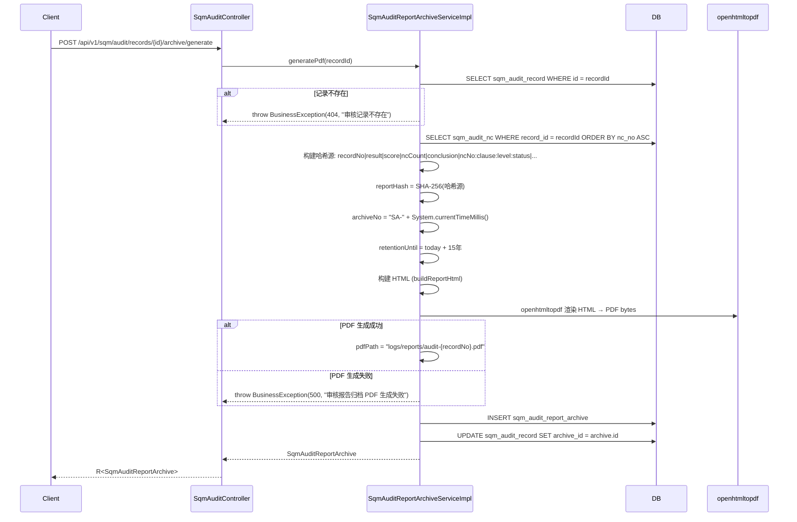
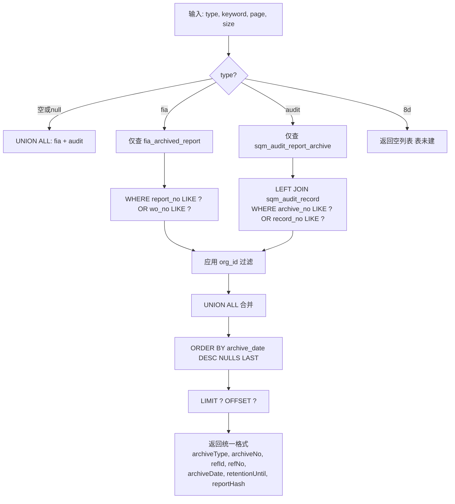

# 归档流程参考 (archive-flow-reference)

> 生成日期: 2026-07-24 | 数据源: `ArchiveServiceImpl` + `FiaTaskServiceImpl.archive()` + `SqmAuditReportArchiveServiceImpl.generatePdf()` + Controller 源码
> 前端路径: 归档查询通过统一 `/api/v1/archives` 端点，FIA/SQM 归档写入通过各自域 Controller
> 权限码: `fia.task.list` / `sqm.audit.list` / `sqm.audit.archive`

---

## 1. 架构概述

归档是跨域共用能力，不独立成域。写入由各业务域触发，查询通过统一的 `ArchiveService` 跨表 UNION。

```
┌─────────────────────────────────────────────────────────┐
│                    统一归档查询层                          │
│  ArchiveController (/api/v1/archives)                    │
│  └── ArchiveServiceImpl (JdbcTemplate UNION ALL)         │
│       ├── ops.fia_archived_report (首件检验归档)          │
│       └── ops.sqm_audit_report_archive (审核报告归档)     │
├─────────────────────────────────────────────────────────┤
│                    业务域归档写入                          │
│  FIA: FiaTaskServiceImpl.archive()                       │
│       └── 触发时机: approve() / submit() 审批/复核通过后  │
│  SQM: SqmAuditReportArchiveServiceImpl.generatePdf()     │
│       └── 触发时机: POST /sqm/audit/records/{id}/archive/ │
│                         generate (手动触发)               │
└─────────────────────────────────────────────────────────┘
```

### 1.1 归档实体

| 表 | 实体类 | 关键字段 | 审计 |
|----|--------|---------|------|
| `ops.fia_archived_report` | `FiaArchivedReport` | `report_no`, `task_id`, `wo_no`, `archive_date`, `status`, `pdf_ref`, `report_hash`, `retention_until` | 无 (plain entity) |
| `ops.sqm_audit_report_archive` | `SqmAuditReportArchive` | `archive_no`, `record_id`, `plan_id`, `supplier_id`, `report_file_path`, `report_hash`, `assembled_at`, `archive_date`, `retention_until` | 无 (plain entity) |

> 归档表均不继承 `BaseEntity`，无 `is_deleted`/`version`/`created_at`/`updated_at` 字段。归档记录一旦写入不可删改。

---

## 2. 归档写入流程

### 2.1 FIA 首件检验归档

`FiaTaskServiceImpl.archive(FiaTask task)` -- 私有方法，由 `approve()` 和 `submit()` 调用。

```mermaid
sequenceDiagram
    participant FIA as FiaTaskServiceImpl
    participant DB
    participant PDF as openhtmltopdf

    FIA->>DB: SELECT fia_insp_item WHERE task_id = task.id
    FIA->>FIA: 构建哈希源: code|woNo|itemName:measuredValue(judge)|...
    FIA->>FIA: reportHash = SHA-256(哈希源)
    FIA->>FIA: reportNo = "AR-" + task.code
    FIA->>FIA: archiveDate = today; retentionUntil = today + 15年
    FIA->>FIA: 构建 HTML (buildReportHtml)
    FIA->>PDF: openhtmltopdf 渲染 HTML → PDF bytes
    alt PDF 生成成功
        FIA->>FIA: pdfRef = "logs/reports/fia-report-{code}.pdf"
    else PDF 生成失败
        FIA->>FIA: pdfRef = "placeholder://{taskId}" (回退占位，不抛异常)
    end
    FIA->>DB: INSERT fia_archived_report
    FIA->>DB: INSERT fia_task_log (logSeq, "归档报告", "系统")
```

**触发时机 (两个调用点)**:
1. `approve()`: 审批放行通过后 → `archive(task)` (行 460)
2. `submit()`: 复核提交通过后 → `archive(task)` (行 672)

**哈希源构造** (`FiaTaskServiceImpl.archive()` 行 834-848):
```
code + '|' + woNo + '|' + itemName + ':' + measuredValue + '(' + judge + ')' + ...
```
例: `FA-20240101-001|WO-12345|温度:25.3(合格)|压力:0.8(合格)|外观:OK(合格)`

**FIA 归档报告 HTML 内容** (`buildReportHtml`):
- 标题: "首件检验归档报告"
- 报告元信息: 报告编号、归档日期、留存至、报告哈希
- 任务信息: 任务编号、工单号、产品名称、工序名称、产线、批次号、触发类型、紧急标志、标准版本、AQL、任务状态、综合判定、处置、提交时间
- 检验项目: 序号、检验项、CTQ、标准值、公差、单位、测量值、判定
- 签名: 检验人、复核人、批准人

### 2.2 SQM 审核报告归档

`SqmAuditReportArchiveServiceImpl.generatePdf(String recordId)` -- 手动触发。



> **与 FIA 的关键差异**: SQM 归档的 PDF 生成失败会抛 `BusinessException(500)` 阻断事务，而 FIA 归档失败仅回退占位符 `"placeholder://{taskId}"` 不阻断。

**哈希源构造** (`SqmAuditReportArchiveServiceImpl.generatePdf()` 行 83-94):
```
recordNo + '|' + result + '|' + score + '|' + ncCount + '|' + conclusion + '|' + ncNo:clause:level:status + ...
```

**SQM 归档报告 HTML 内容** (`buildReportHtml`):
- 标题: "供应商审核报告归档"
- 归档元信息: 归档编号、归档时间、留存至、报告哈希
- 审核记录: 记录编号、审核类型、审核日期、审核组长、审核组、审核结果、审核得分、NC数量、审核结论、状态
- NC 列表: 序号、NC编号、条款、描述、级别、状态、责任人、整改措施、验证结论

---

## 3. 统一归档查询流程

### 3.1 查询入口

`ArchiveController` -- `/api/v1/archives`:
- `GET /api/v1/archives?type=fia|audit|8d&keyword=X&page=1&size=20` -- 统一归档查询
- `GET /api/v1/archives/expiring?days=30` -- 留存到期提醒

`FiaTaskController` -- 域内 FIA 归档查询:
- `GET /api/v1/fia/tasks/{id}/archive` -- 单任务归档报告
- `GET /api/v1/fia/tasks/archives` -- FIA 归档列表 (含关联任务/用户信息)

`SqmAuditController` -- 域内 SQM 归档查询:
- `GET /api/v1/sqm/audit/records/{id}/archive` -- 某审核记录的所有归档
- `POST /api/v1/sqm/audit/records/{id}/archive/generate` -- 触发归档生成

### 3.2 ArchiveService.list() 查询逻辑

`ArchiveServiceImpl.list(type, keyword, page, size)`:



**org_id 过滤** (`orgFilter()` 方法):
- 管理员 (`CompanyContext.isAdmin()`) → 不过滤，返回空串
- 普通用户 → 拼接 `AND org_id = '{userId}'`（注意: SQL 注入防护通过 `replace("'", "''")`）
- JdbcTemplate 不走 MyBatis-Plus 拦截器，需手工拼接

**统一返回格式**:
| 字段 | 来源 | 说明 |
|------|------|------|
| `archiveType` | 子查询 alias | `fia` / `audit` |
| `archiveNo` | fia: `report_no`, sqm: `archive_no` | 归档编号 |
| `refId` | fia: `task_id`, sqm: `record_id` | 关联业务ID |
| `refNo` | fia: `wo_no`, sqm: `record_no`(LEFT JOIN) | 关联业务编号 |
| `archiveDate` | 转为日期字符串 | 归档日期 |
| `retentionUntil` | 转为日期字符串 | 留存到期日 |
| `reportHash` | `report_hash` | SHA-256 哈希 |

### 3.3 ArchiveService.expiring() 留存到期提醒

`ArchiveServiceImpl.expiring(days)`:

1. 构建 UNION ALL 查询:
   - FIA: `SELECT ... FROM ops.fia_archived_report WHERE retention_until <= CURRENT_DATE + ?::int`
   - SQM: `SELECT ... FROM ops.sqm_audit_report_archive WHERE retention_until <= CURRENT_DATE + ?::int`
2. 合并后 `ORDER BY retention_until ASC`
3. 计算 `daysRemaining = ChronoUnit.DAYS.between(today, retentionUntil)` (可为负数表示已过期)

返回格式: `[archiveType, archiveNo, refId, retentionUntil, daysRemaining]`

---

## 4. 关键业务规则

### 4.1 归档不可变性

- 归档表不继承 `BaseEntity`，无 `is_deleted`、`version` 字段
- 无 update / delete 接口 (Service 层只有 `insert` 和 `select`)
- 归档一旦写入，不可删改

### 4.2 保留期 15 年

- FIA: `retentionUntil = archiveDate.plusYears(15)` (LocalDate)
- SQM: `retentionUntil = LocalDate.now().plusYears(15)` (LocalDate)

### 4.3 SHA-256 哈希链

- 各归档独立计算 SHA-256，不跨记录链接
- FIA 哈希源: `code|woNo|itemName:measuredValue(judge)|...`
- SQM 哈希源: `recordNo|result|score|ncCount|conclusion|ncNo:clause:level:status|...`
- 哈希值存入 `report_hash` (CHAR(64))
- 用于防篡改验证，但当前无独立的验证接口

### 4.4 PDF 存储

- FIA: 存本地 `logs/reports/fia-report-{code}.pdf`，`pdf_ref` 字段存路径
- SQM: 存本地 `logs/reports/audit-{recordNo}.pdf`，`report_file_path` 字段存路径
- 均不接 MinIO (虽然 FIA 实体注释写 "MinIO key"，实际为本地路径)
- FIA 归档 PDF 生成失败回退占位符 `"placeholder://{taskId}"`，SQM 归档 PDF 生成失败抛异常

---

## 5. 接口清单

### 5.1 ArchiveController (`/api/v1/archives`) -- 统一归档查询

| # | 方法 | 路径 | 权限码 | 参数 | 响应 | 说明 |
|---|------|------|--------|------|------|------|
| 1 | GET | `/api/v1/archives` | `sqm.audit.list` 或 `fia.task.list` | `?type=fia\|audit\|8d&keyword=X&page=1&size=20` | `R<List<Map>>` | 统一归档查询 |
| 2 | GET | `/api/v1/archives/expiring` | `sqm.audit.list` 或 `fia.task.list` | `?days=30` (默认30) | `R<List<Map>>` | 留存到期提醒 |

### 5.2 FiaTaskController -- FIA 归档查询

| # | 方法 | 路径 | 权限码 | 参数 | 响应 | 说明 |
|---|------|------|--------|------|------|------|
| 1 | GET | `/api/v1/fia/tasks/{id}/archive` | `fia.task.list` | `{id}` | `R<FiaArchivedReport>` | 单任务归档报告 |
| 2 | GET | `/api/v1/fia/tasks/archives` | `fia.task.list` | -- | `R<List<Map>>` | FIA 归档列表(含关联数据) |

### 5.3 SqmAuditController -- SQM 归档查询/生成

| # | 方法 | 路径 | 权限码 | 参数 | 响应 | 说明 |
|---|------|------|--------|------|------|------|
| 1 | GET | `/api/v1/sqm/audit/records/{id}/archive` | `sqm.audit.list` | `{id}` | `R<List<SqmAuditReportArchive>>` | 审核记录归档列表 |
| 2 | POST | `/api/v1/sqm/audit/records/{id}/archive/generate` | `sqm.audit.archive` | `{id}` | `R<SqmAuditReportArchive>` | 手动触发归档生成 |

---

## 6. 后端已知缺口

### 6.1 @PreAuthorize 括号 bug (严重)

`ArchiveController` 两处 `@PreAuthorize` 存在多余右括号，导致接口不可用:

```java
// 当前 (错误):
@PreAuthorize("hasAuthority('sqm.audit.list')) or hasAuthority('fia.task.list')")
//                                     ↑ 多余 )
// 应为:
@PreAuthorize("hasAuthority('sqm.audit.list') or hasAuthority('fia.task.list')")
```

**影响**: `GET /api/v1/archives` 和 `GET /api/v1/archives/expiring` 两个端点均无法通过 Spring Security 表达式解析，返回 403 或启动报错。

**位置**: `ArchiveController.java` 行 38 和行 51。

### 6.2 8D 归档表未建

`ArchiveService.list()` 中 `type=8d` 直接返回空列表。`ops.qms_8d_report` 表存在但无对应归档表。`ArchiveServiceImpl` 注释: "8D 归档表暂未建,type=8d 返回空列表"。

### 6.3 SPC 归档未覆盖

`ArchiveService` 仅覆盖 FIA 和 SQM 审计，不包含 SPC 控制图/子组/能力结果归档。SPC 域的数据归档需求未定义。

### 6.4 PDF 无下载端点

- FIA 归档 PDF 生成后写入 `logs/reports/`，但无 HTTP 端点下载
- SQM 归档 PDF 同样无下载端点
- 前端无法直接获取 PDF 文件

### 6.5 哈希链未跨记录链接

各归档独立计算 SHA-256，但 `report_hash` 不包含前一条归档的哈希值，未形成真正的区块链式防篡改链。当前仅为单条记录的摘要。

### 6.6 无归档验证接口

没有对外的 `GET /api/v1/archives/{id}/verify` 端点来验证归档报告的 SHA-256 哈希完整性。

### 6.7 FIA 归档 PDF 生成失败静默回退

`FiaTaskServiceImpl.generatePdf()` 失败时仅 `log.warn` 并返回 `"placeholder://{taskId}"`，不通知用户，前端可能展示空报告。

### 6.8 `orgFilter()` SQL 注入风险

`ArchiveServiceImpl.orgFilter()` 使用字符串拼接 `"AND org_id = '" + orgId.replace("'", "''") + "'"` 而非参数化查询。虽做了基本转义，但不如 `PreparedStatement` 参数化安全。

### 6.9 域内与统一查询数据不一致

- `FiaTaskController.listArchives()` 返回完整关联数据 (含任务信息、检验人姓名、标准编码等)
- `ArchiveController.list()` 返回扁平化格式 (仅 `archiveType`, `archiveNo`, `refId`, `refNo`, `archiveDate`, `retentionUntil`, `reportHash`)
- 两套查询接口返回格式不一致，前端需要适配两套结构