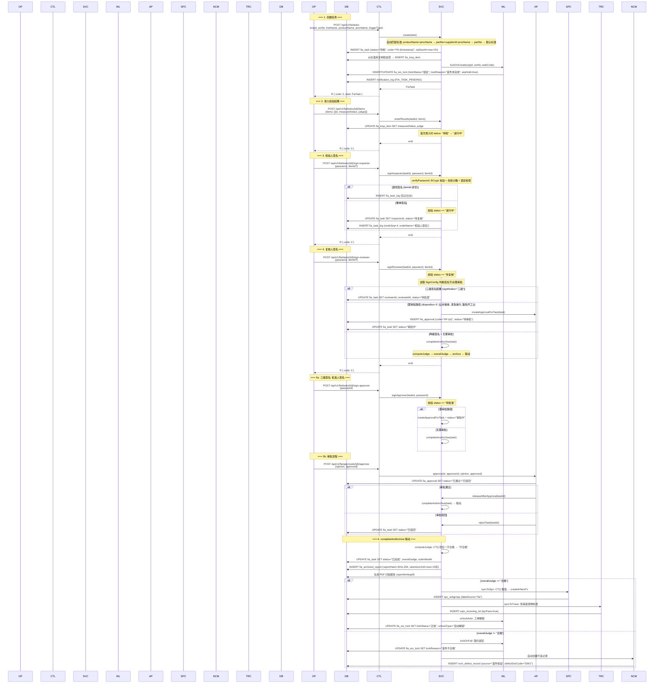
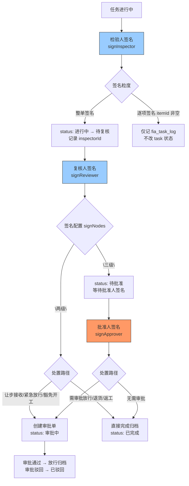
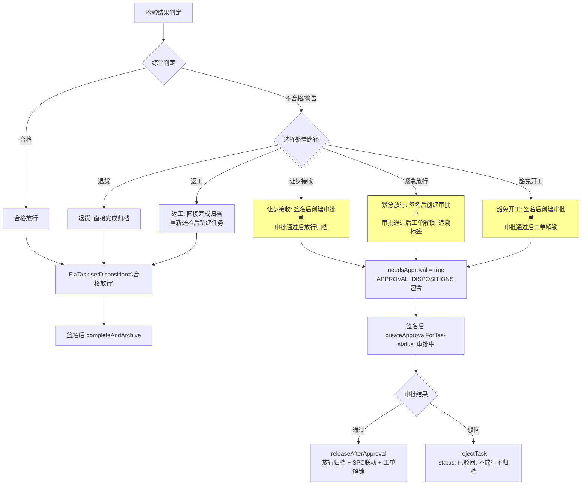
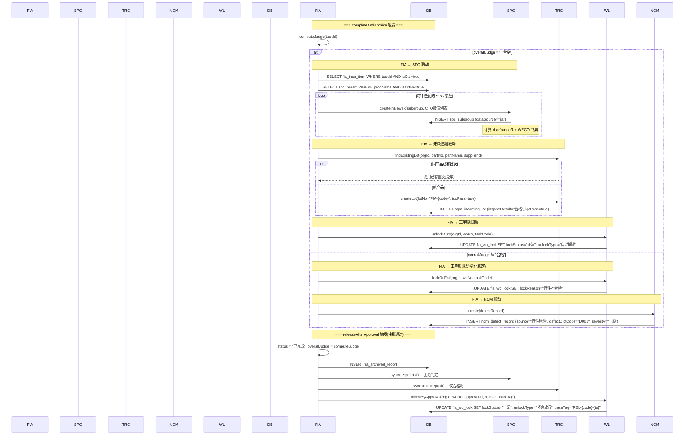

# FIA 域业务流程参考文档

> 康立 QMS 首件检验域 | 生成日期: 2026-07-24
> 数据源: FiaTaskServiceImpl / FiaApprovalServiceImpl / FiaWoLockServiceImpl / SignConfigServiceImpl / QmsEnums / FiaTaskController / FiaApprovalController

---

## 1. 完整检验流程时序图

从创建首件任务到归档的全链路。



---

## 2. 状态机流转图

```mermaid
stateDiagram-v2
    [*] --> "待检": create() 创建任务
    "待检" --> "进行中": enterResults() 首次录入
    "待检" --> "超时": 定时任务扫描 slaDueAt < now
    "待检" --> "已作废": 手动作废
    "进行中" --> "待复核": signInspector() 检验人整单签名
    "进行中" --> "进行中": enterResults() 补充录入(状态不变)
    "待复核" --> "待批准": signReviewer() 三级签名配置
    "待复核" --> "审批中": signReviewer() 需审批路径(让步/紧急/豁免)
    "待复核" --> "已完成": signReviewer() 两级签名+无需审批
    "待批准" --> "审批中": signApprover() 需审批路径
    "待批准" --> "已完成": signApprover() 无需审批
    "审批中" --> "已完成": approve() 审批通过 → releaseAfterApproval()
    "审批中" --> "已驳回": approve() 审批驳回 → rejectTask()
    "已完成" --> [*]: 归档(15年保留)
    "超时" --> [*]
    "已作废" --> [*]
    "已驳回" --> [*]
```

**状态枚举** (`QmsEnums.FiaTaskStatus`):

| 状态 | 常量 | 触发条件 | 下一状态 |
|------|------|----------|----------|
| 待检 | `PENDING` | 创建任务时 | 进行中 / 超时 / 已作废 |
| 进行中 | `IN_PROGRESS` | 首次录入检验结果 | 待复核 |
| 待复核 | `WAIT_REVIEW` | 检验人整单签名 | 待批准 / 审批中 / 已完成 |
| 待批准 | (硬编码) | 三级签名复核后 | 审批中 / 已完成 |
| 审批中 | `IN_APPROVAL` | 需审批路径创建审批单 | 已完成 / 已驳回 |
| 已完成 | `COMPLETED` | 归档完成 | 终态 |
| 超时 | `OVERDUE` | SLA 超时 | 终态 |
| 已作废 | `CANCELLED` | 手动作废 | 终态 |
| 已驳回 | `REJECTED` | 审批驳回 | 终态 |

**状态流转代码位置**:
- `create()`: `task.setStatus(FiaTaskStatus.PENDING)` (第 212 行)
- `enterResults()`: `PENDING → IN_PROGRESS` (第 297 行)
- `signInspector()`: `IN_PROGRESS → WAIT_REVIEW` (第 323 行)
- `signReviewer()`: `WAIT_REVIEW → 待批准/审批中/已完成` (第 349-361 行)
- `signApprover()`: `待批准 → 审批中/已完成` (第 367-383 行)
- `releaseAfterApproval()`: `IN_APPROVAL → COMPLETED` (第 456 行)
- `rejectTask()`: `IN_APPROVAL → REJECTED` (第 505 行)

---

## 3. 三级签名流程



**签名配置** (`FiaSignConfig`):

| 配置项 | 可选值 | 默认值 | 说明 |
|--------|--------|--------|------|
| `signMethods` | `["password", "handwriting", "ca"]` | 全部三种 | 签名方式，含 `password` 时需校验密码 |
| `signNodes` | `"两级"` / `"三级"` | `"两级"` | 签名节点数 |
| `signGranularity` | `"整单签名"` / `"逐项签名"` | `"整单签名"` | 签名粒度 |
| `lockAfterFail` | 整数 | `3` | 密码错误锁定阈值 |
| `lockMinutes` | 整数 | `5` | 锁定分钟数 |

**密码校验逻辑** (`verifyPassword`, 第 621-659 行):
1. 读取 `FiaSignConfig`，若 `signMethods` 不含 `"password"` 则跳过校验
2. `lockUntil` 未过期时拒绝签名(账号锁定中)
3. BCrypt 校验密码，失败则 `failCount++`
4. `failCount >= lockAfterFail` → 设置 `lockUntil = now + lockMinutes`，拒绝签名
5. 密码正确后重置 `failCount = 0`, `lockUntil = null`

**`computeJudge` 判定逻辑** (第 823-832 行):
```java
// CTQ 项任一不合格 → 整体"不合格"
boolean anyCtqFail = items.stream().anyMatch(
    i -> Boolean.TRUE.equals(i.getIsCtq()) && "不合格".equals(i.getJudge()));
if (anyCtqFail) return "不合格";

// 非 CTQ 项有不合格 → "警告"
boolean anyFail = items.stream().anyMatch(i -> "不合格".equals(i.getJudge()));
return anyFail ? "警告" : "合格";
```

---

## 4. 处置流程



**处置路径枚举** (`QmsEnums`):

产线首件 (`source = FACTORY`):
| 常量 | 值 | 需审批 |
|------|-----|--------|
| `FactoryDisposition.RELEASE` | `"合格放行"` | 否 |
| `FactoryDisposition.RETURN` | `"退货"` | 否 |
| `FactoryDisposition.REWORK` | `"返工"` | 否 |
| `FactoryDisposition.CONCESSION` | `"让步接收"` | **是** |
| `FactoryDisposition.EMERGENCY` | `"紧急放行"` | **是** |
| `FactoryDisposition.EXEMPTION` | `"豁免开工"` | **是** |

来料首件 (`source = SUPPLIER`):
| 常量 | 值 | 需审批 |
|------|-----|--------|
| `SupplierDisposition.ACCEPT` | `"合格入库"` | 否 |
| `FactoryDisposition.RETURN` | `"退货"` | 否 |
| `FactoryDisposition.CONCESSION` | `"让步接收"` | **是** |
| `SupplierDisposition.SORT` | `"挑选"` | 否 |

**审批触发条件** (`needsApproval`, 第 419-422 行):
```java
private static final Set<String> APPROVAL_DISPOSITIONS =
    Set.of(FactoryDisposition.CONCESSION,   // "让步接收"
           FactoryDisposition.EMERGENCY,    // "紧急放行"
           FactoryDisposition.EXEMPTION);   // "豁免开工"
```

---

## 5. 联动时序图

FIA 任务完成/审批通过后与各模块的联动。



**联动异常处理**: 所有联动调用均被 `try-catch` 包裹，失败仅 `log.warn`，**不阻断 FIA 主流程**。

---

## 6. 来料首件 vs 产线首件

| 维度 | 产线首件 (`source=FACTORY`) | 来料首件 (`source=SUPPLIER`) |
|------|----------------------------|------------------------------|
| Controller | `FiaTaskController` (`/api/v1/fia/tasks`) | `FiaIncomingCheckController` (`/api/v1/fia/incoming-checks`) |
| 创建方式 | 手动创建: POST /tasks | 手动创建 + 来料批次驱动: POST /incoming-checks/batch-by-lot |
| 触发类型 | 换模/换设备/首班/换料/停线重启 | 来料入库 (IQC 触发) |
| 处置路径 | 合格放行/退货/返工/让步接收/紧急放行/豁免开工 | 合格入库/退货/让步接收/挑选 |
| 工单锁定 | **是**: 创建时锁定，合格解锁，不合格强化锁定 | **否**: 不触发 FiaWoLock |
| 标准匹配 | productName + procName → partNo + supplierId + procName → partNo → 默认标准 | 同上 + 检验计划匹配 |
| AQL 抽样 | 默认不计算 | 批量建单时按 AQL 抽样表自动计算 sampleSize |
| 审批 | 让步接收/紧急放行/豁免开工需审批 | 让步接收需审批 |

**来料批量建单** (`batchCreateByLot`, FiaTaskController 第 166-252 行):
1. 按 `lotNo` 查 `sqm_incoming_lot` 获取物料信息
2. 按物料编码 + 供应商匹配激活的检验计划 (`fia_insp_plan`)
3. 无匹配时回退: 仅物料编码(忽略供应商) → 通用默认计划(`isDefault=true`)
4. 对每个计划: 创建 FiaTask(source=SUPPLIER, triggerType="来料入库"), AQL 抽样计算 `sampleSize`
5. 返回: `{ lotNo, partNo, plansFound, tasksCreated, tasksFailed, tasks: [...] }`

---

## 7. 接口调用顺序

一个完整产线首件任务从创建到归档的 API 调用链:

```
1.  GET  /api/v1/fia/triggers              # 获取触发类型列表(下拉框)
2.  GET  /api/v1/fia/stds                  # 获取检验标准列表(选择标准)
3.  GET  /api/v1/fia/tasks/match-std       # 可选: 按物料+工序匹配标准
4.  GET  /api/v1/fia/sign-config           # 获取签名配置(确认签名方式/节点)
5.  POST /api/v1/fia/tasks                 # 创建首件任务
     ↓ 自动: 工单锁定 + 待检通知 + 标准匹配 + 检验项复制
6.  GET  /api/v1/fia/tasks/{id}            # 查看任务详情(含检验项列表)
7.  POST /api/v1/fia/tasks/{id}/items      # 录入检验结果(逐项 measuredValue + judge)
8.  POST /api/v1/fia/tasks/{id}/disposition # 设置处置路径(如不合格选让步接收)
9.  POST /api/v1/fia/tasks/{id}/sign-inspector  # 检验人签名(整单/逐项)
10. POST /api/v1/fia/tasks/{id}/sign-reviewer   # 复核人签名
     ↓ 若需审批: 自动创建审批单, status="审批中"
11. GET  /api/v1/fia/approvals             # 查看审批单列表
12. POST /api/v1/fia/approvals/{id}/approve # 审批(通过/驳回)
     ↓ 审批通过: 放行归档 + SPC联动 + 来料追溯联动 + 工单解锁
13. GET  /api/v1/fia/tasks/{id}/archive    # 查看归档报告
14. GET  /api/v1/fia/tasks/{id}/log        # 查看任务审计日志(节点序列)
15. GET  /api/v1/fia/wo-lock?woNo=xxx      # 查询工单当前锁定状态
```

**来料首件批量建单**:
```
1. GET  /api/v1/fia/incoming-checks/match-std  # 按物料+供应商匹配标准
2. POST /api/v1/fia/incoming-checks/batch-by-lot # 来料批次驱动批量建单
     ↓ 后续流程同产线首件 6-15
```

---

## 8. 关键业务规则

### 8.1 CTQ 项不合格 → 整体不合格

`computeJudge()` (第 823-832 行):
- 任一 CTQ 项判定为 `"不合格"` → 整体 `"不合格"`
- 无 CTQ 不合格但有非 CTQ 项不合格 → 整体 `"警告"`
- 全部合格 → 整体 `"合格"`

### 8.2 签名密码校验 + 失败锁定

`verifyPassword()` (第 621-659 行):
- 仅在 `signMethods` 含 `"password"` 时校验
- 检查 `lockUntil` 是否过期，未过期拒绝签名
- BCrypt 校验失败 → `failCount++`，达到 `lockAfterFail`(默认 3) → 设置 `lockUntil = now + lockMinutes`(默认 5 分钟)
- 密码正确后重置 `failCount = 0`, `lockUntil = null`

### 8.3 SLA 2 小时超时

`create()` (第 215 行):
```java
task.setSlaDueAt(LocalDateTime.now().plusHours(2));
```
- 创建任务时自动设置 `slaDueAt = now + 2 小时`
- 定时任务扫描 `slaDueAt < now` 且 `status` 非终态 → 置 `status = "超时"`
- 超时通知写入 `notification_log`(一期仅站内通知, 角色广播给检验员/班组长)

### 8.4 归档哈希链 SHA-256

`archive()` (第 834-853 行):
```java
String content = task.getCode() + '|' + task.getWoNo() + '|' + 每个检验项(itemName:measuredValue(judge)) + ...
r.setReportHash(sha256(content));
```
- 归档内容: 任务编号 + 工单号 + 全部检验项 + 签名记录
- SHA-256 哈希写入 `fia_archived_report.report_hash`
- 保留期限: `retentionUntil = now + 15 年`
- PDF 归档报告由 openhtmltopdf 生成，存 `logs/reports/` 目录

### 8.5 审批去重

`createApprovalForTask()` (第 425-438 行):
```java
fiaApprovalService.removePendingByTask(task.getId()); // 先清待审批的旧审批单
// 再建新审批单
```
- 每次签名触发审批前，先删除该任务下所有 `status="待审批"` 的旧审批单
- 确保签名失败不会留下孤儿审批单，重签时不会出现重复审批单

### 8.6 幂等安全

- `releaseAfterApproval()`: 仅 `status == "审批中"` 时执行，否则直接返回(第 453 行)
- `rejectTask()`: 仅 `status == "审批中"` 时执行，否则直接返回(第 502 行)
- `unlockAuto()`: 仅 `lockStatus == "锁定"` 时执行，否则返回(第 97-98 行)

### 8.7 标准匹配链

`create()` 中的标准匹配优先级 (第 189-207 行):
```
1. 显式传入 stdId → 按 UUID 或 code 查标准库
2. productName + procName → 匹配 material + procName (status="生效")
3. partNo + supplierId + procName → matchStd() 三级匹配
4. partNo + procName → matchStd() 忽略供应商
5. partNo → matchStd() 仅物料编码
6. 兜底: 通用默认标准 (isDefault=true, status="生效")
7. 全部失败 → throw BusinessException(400)
```

`matchStd()` 的匹配链 (第 143-167 行):
```
1. orgId + partNo + procName → 精确匹配
2. orgId + partNo → 忽略工序
3. orgId + isDefault=true → 通用默认标准
```

---

## 附录 A: FIA 权限码清单

| 权限码 | 应用接口 | 说明 |
|--------|----------|------|
| `fia.task.list` | GET /tasks/*, GET /tasks/dashboard, GET /tasks/{id}, GET /tasks/archives, GET /tasks/{id}/archive, GET /tasks/{id}/log, GET /tasks/match-std, GET /incoming-checks/*, GET /wo-lock | 查看首件任务 |
| `fia.task.create` | POST /tasks, POST /tasks/items, POST /tasks/batch-by-lot, POST /incoming-checks/batch-by-lot, POST /incoming-checks/{id}/items | 创建任务/录入检验结果 |
| `fia.task.disposition` | POST /tasks/{id}/disposition | 设置处置路径 |
| `fia.sign.inspector` | POST /tasks/{id}/sign-inspector, POST /incoming-checks/{id}/sign-inspector | 检验人签名 |
| `fia.sign.reviewer` | POST /tasks/{id}/sign-reviewer, POST /incoming-checks/{id}/sign-reviewer | 复核人签名 |
| `fia.sign.approver` | POST /tasks/{id}/sign-approver, POST /incoming-checks/{id}/sign-approver | 批准人签名 |
| `fia.sign.disposition` | POST /incoming-checks/{id}/disposition | 来料处置 |
| `fia.std.list` | GET /stds, GET /stds/{id} | 查看检验标准 |
| `fia.std.create` | POST /stds, PUT /stds/{id}, POST /triggers, PUT /triggers/*, PUT /intercept-config, PUT /sign-config, GET/POST /approvals/* | 管理检验标准/触发类型/审批/配置 |
| `fia.std.delete` | DELETE /stds/{id}, DELETE /triggers/{id} | 删除标准/触发类型 |

---

## 附录 B: 相关源码文件

| 文件 | 说明 |
|------|------|
| `qms-service/.../fia/impl/FiaTaskServiceImpl.java` | 核心: 任务创建/检验录入/签名/归档/联动 |
| `qms-service/.../fia/impl/FiaApprovalServiceImpl.java` | 审批: 创建/审批通过/驳回/去重 |
| `qms-service/.../fia/impl/FiaWoLockServiceImpl.java` | 工单锁: lockOnCreate/lockOnFail/unlockAuto/unlockByApproval |
| `qms-service/.../fia/impl/SignConfigServiceImpl.java` | 签名配置: 默认值(两级/整单/3次锁定5分钟) |
| `qms-service/.../fia/impl/InspStdServiceImpl.java` | 检验标准库 CRUD |
| `qms-service/.../fia/impl/FiaTriggerTypeServiceImpl.java` | 触发类型管理 |
| `qms-service/.../fia/impl/FiaInterceptConfigServiceImpl.java` | 拦截配置 |
| `qms-common/.../enums/QmsEnums.java` | 全局枚举: FiaTaskStatus/FactoryDisposition/SupplierDisposition |
| `qms-api/.../fia/controller/FiaTaskController.java` | 产线首件 Controller |
| `qms-api/.../fia/controller/FiaApprovalController.java` | 审批 Controller |
| `qms-bootstrap/.../DataInitializer.java` | FIA 标准库种子(seedFiaStd) + 权限码种子(seedFiaPerms) |