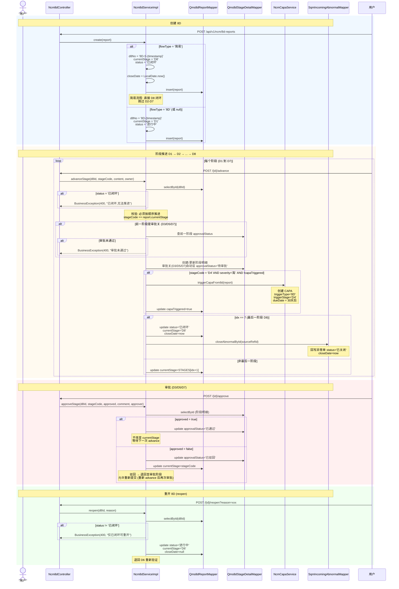
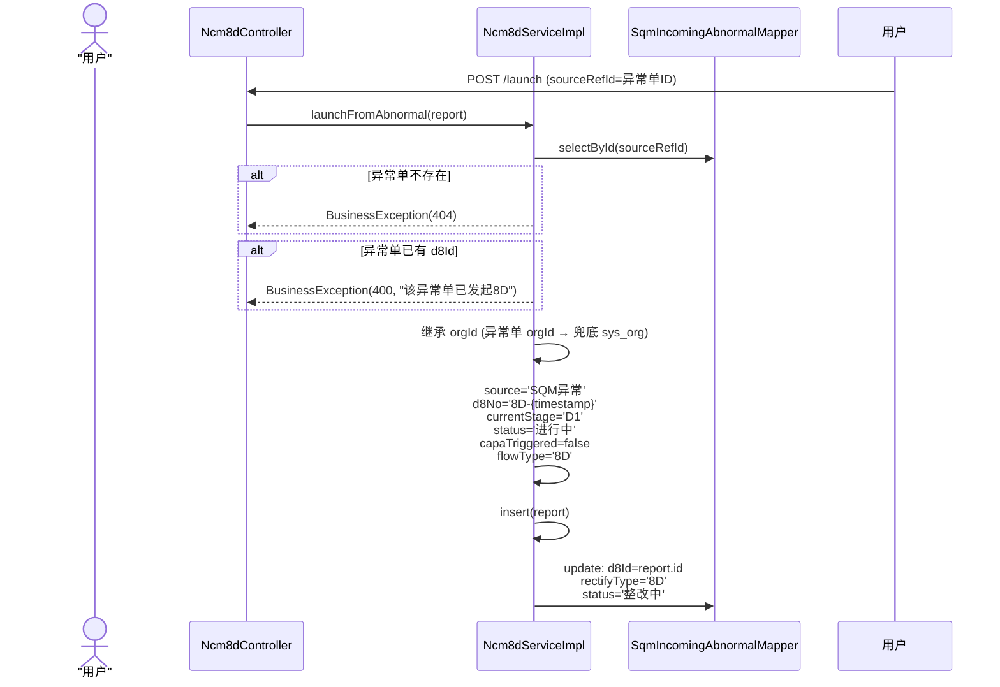
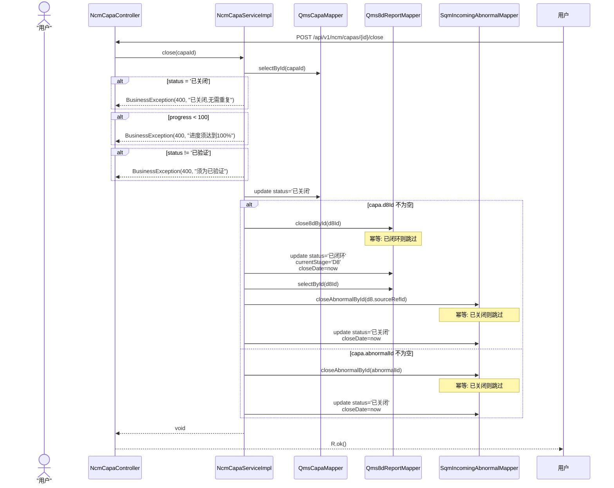
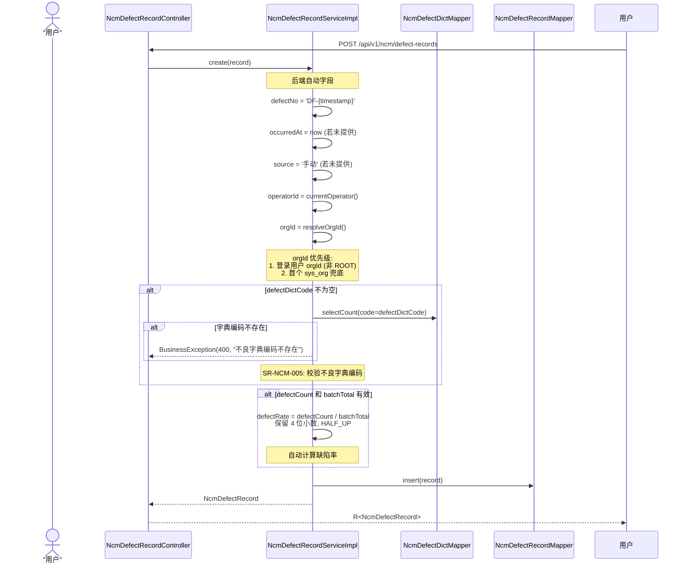
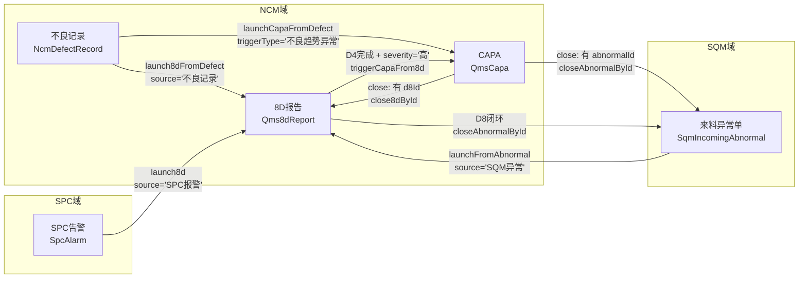

# NCM 不良管理业务流程参考

> 生成日期: 2026-07-24 | 数据源: Service 源码 + Controller 源码 + SRS 流程图手册
> 后端包: `com.konli.qms.service.ncm.impl` | 11 个 Controller, 54 个 API 端点

---

## 1. 8D 完整流程时序图

核心入口: `Ncm8dServiceImpl` (lines 1-317)



### 8D 阶段顺序 (STAGES)

实现位置: `Ncm8dServiceImpl` line 38

```java
private static final String[] STAGES = {"D1", "D2", "D3", "D4", "D5", "D6", "D7", "D8"};
```

### 审批关口 (APPROVAL_STAGES)

实现位置: `Ncm8dServiceImpl` line 41

```java
private static final List<String> APPROVAL_STAGES = Arrays.asList("D3", "D5", "D7");
```

### 从异常单发起 8D (launchFromAbnormal)

实现位置: `Ncm8dServiceImpl.launchFromAbnormal()` lines 99-133

`POST /api/v1/ncm/8d-reports/launch`



---

## 2. 8D 状态机

```mermaid
stateDiagram-v2
    [*] --> D1 : create(flowType='8D')

    state "简易流程" {
        [*] --> D8闭环简 : create(flowType='简易')
        "D8闭环简" --> [*] : status='已闭环'<br/>currentStage='D8'
    }

    D1 --> D2 : advanceStage(D1)
    D2 --> D3 : advanceStage(D2)
    D3 --> "D3待审批" : advanceStage(D3)<br/>approvalStatus='待审批'

    state "D3待审批" {
        [*] --> "审批中"
        "审批中" --> "已通过" : approve(approved=true)
        "审批中" --> "已驳回" : approve(approved=false)
    }

    "D3待审批" --> D4 : advanceStage(D4)<br/>前置: D3审批='已通过'
    D4 --> D5 : advanceStage(D4)<br/>完成时 severity='高' 自动触发 CAPA

    state "D4触发CAPA" {
        [*] --> "检查严重度"
        "检查严重度" --> "触发CAPA" : severity='高'<br/>capaTriggered=false
        "检查严重度" --> "不触发" : severity='低'/'中'
        "触发CAPA" --> "capaTriggered=true"
    }

    D5 --> "D5待审批" : advanceStage(D5)<br/>approvalStatus='待审批'

    state "D5待审批" {
        [*] --> "审批中"
        "审批中" --> "已通过" : approve(approved=true)
        "审批中" --> "已驳回" : approve(approved=false)
    }

    "D5待审批" --> D6 : advanceStage(D6)<br/>前置: D5审批='已通过'
    D6 --> D7 : advanceStage(D6)
    D7 --> "D7待审批" : advanceStage(D7)<br/>approvalStatus='待审批'

    state "D7待审批" {
        [*] --> "审批中"
        "审批中" --> "已通过" : approve(approved=true)
        "审批中" --> "已驳回" : approve(approved=false)
    }

    "D7待审批" --> D8 : advanceStage(D8)<br/>前置: D7审批='已通过'

    state "D8" {
        [*] --> "已闭环" : status='已闭环'<br/>closeDate=now<br/>回写异常单 status='已关闭'
    }

    "D8" --> D6 : reopen(reason)<br/>status='进行中'<br/>currentStage='D6'<br/>closeDate=null

    "D3待审批" --> D3 : 驳回 (currentStage退回D3)
    "D5待审批" --> D5 : 驳回 (currentStage退回D5)
    "D7待审批" --> D7 : 驳回 (currentStage退回D7)
```

### 8D 状态枚举值

| status | 含义 | 触发条件 |
|--------|------|----------|
| `进行中` | 8D 流程执行中 | 创建时 (flowType='8D') 或 reopen |
| `已闭环` | 8D 完成闭环 | 推进到 D8 或简易流程创建 |

| currentStage | 含义 |
|-------------|------|
| D1 | 组建团队 |
| D2 | 问题描述 |
| D3 | 临时措施 (审批关) |
| D4 | 根因分析 |
| D5 | 纠正措施 (审批关) |
| D6 | 实施验证 |
| D7 | 预防措施 (审批关) |
| D8 | 总结关闭 |

| approvalStatus | 含义 |
|---------------|------|
| `待审批` | 阶段推进到审批关自动设置 |
| `已通过` | 审批人 approve(approved=true) |
| `已驳回` | 审批人 approve(approved=false) |

---

## 3. CAPA 状态机

实现位置: `NcmCapaServiceImpl` (lines 1-220)

```mermaid
stateDiagram-v2
    [*] --> "待启动" : create(CAPA)<br/>capaNo='CAPA-{timestamp}'<br/>progress=0<br/>dueDate=30天后

    "待启动" --> "分析中" : 自动/手动推进

    state "分析中" {
        [*] --> "根因调查"
        "根因调查" --> "制定措施"
    }

    "分析中" --> "待审批" : updateProgress(progress>=60)<br/>且当前非'实施中'

    state "待审批" {
        [*] --> "审批中"
        "审批中" --> "通过" : approve(approved=true)
        "审批中" --> "驳回" : approve(approved=false)
    }

    "待审批" --> "实施中" : 审批通过

    "实施中" --> "已验证" : updateProgress(progress=100)

    "已验证" --> "已关闭" : close()<br/>前置: progress>=100<br/>且 status='已验证'

    state "已关闭" {
        [*] --> "级联闭环"
        "级联闭环" --> "8D闭环" : 若有 d8Id<br/>→ close8dById(d8Id)
        "级联闭环" --> "异常单闭环" : 回写异常单<br/>status='已关闭'
    }

    "待审批" --> "分析中" : 驳回<br/>progress=50<br/>status='分析中'

    "分析中" --> "分析中" : reset(reason)<br/>progress=0<br/>status='分析中'

    "已关闭" --> [*]

    note right of "分析中"
        SR-CAR 分支4: 从异常单触发时
        自动检测同供应商同物料
        30天内 >=2 次异常
        → triggerType='重复问题'
    end note
```

### CAPA 状态枚举值

| status | 含义 | 触发条件 |
|--------|------|----------|
| `待启动` | 刚创建 | `create()` 方法默认 |
| `分析中` | 问题分析/根因调查 | 审批驳回 (progress=50) 或 reset (progress=0) |
| `待审批` | 等待审批 | progress >= 60 且当前非 "实施中" |
| `实施中` | 审批通过后执行 | approve(approved=true) |
| `已验证` | 验证完成 | progress = 100 |
| `已关闭` | CAPA 闭环 | close() 且 progress >= 100 且 status = "已验证" |

### CAPA 关键方法

| 方法 | 路径 | 触发条件 | 行为 |
|------|------|----------|------|
| `create()` | `POST /api/v1/ncm/capas` | -- | status='待启动', progress=0, dueDate=30天后 |
| `updateProgress()` | `POST /{id}/progress?progress=N` | progress=100 | status='已验证' |
| | | progress>=60 且非"实施中" | status='待审批' |
| `approve()` | `POST /{id}/approve` | approved=true | status='实施中' |
| | | approved=false | progress=50, status='分析中' |
| `close()` | `POST /{id}/close` | progress>=100 且 status='已验证' | status='已关闭' + 级联闭环 |
| `reset()` | `POST /{id}/reset` | -- | progress=0, status='分析中' |

---

## 4. CAPA 闭环级联时序图

实现位置: `NcmCapaServiceImpl.close()` lines 158-189



### 闭环链路总结

```
CAPA.close()
  ├── 有 d8Id → close8dById(d8Id)
  │     └── 8D: status='已闭环', currentStage='D8', closeDate=now
  │           └── closeAbnormalById(d8.sourceRefId)
  │                 └── 异常单: status='已关闭', closeDate=now
  └── 仅有 abnormalId → closeAbnormalById(abnormalId)
        └── 异常单: status='已关闭', closeDate=now
```

---

## 5. 不良记录录入流程

实现位置: `NcmDefectRecordServiceImpl.create()` lines 54-84



### 后端自动填充字段

| 字段 | 自动生成逻辑 | 方法 |
|------|-------------|------|
| `defectNo` | `"DF-" + System.currentTimeMillis()` | `create()` line 55 |
| `occurredAt` | `LocalDateTime.now()` (若前端未传) | `create()` line 56-58 |
| `source` | `"手动"` (若前端未传) | `create()` line 59-61 |
| `operatorId` | `CompanyContext.get().userId()` (兜底 "系统") | `create()` line 62-64 |
| `orgId` | 登录用户 orgId (非 ROOT) → 首个 sys_org 兜底 | `resolveOrgId()` lines 453-464 |
| `defectRate` | `defectCount / batchTotal` (4 位小数) | `create()` line 77-81 |

---

## 6. 联动全景图



### 各联动路径详解

| 路径 | 触发方式 | 入口 | 关联方式 |
|------|----------|------|----------|
| 不良记录 → 8D | `POST /defect-records/{id}/launch-8d` | `NcmDefectRecordServiceImpl.launch8dFromDefect()` | `source='不良记录'`, `sourceRefId=defectId` |
| 不良记录 → CAPA | `POST /defect-records/{id}/launch-capa` | `NcmDefectRecordServiceImpl.launchCapaFromDefect()` | `triggerType='不良趋势异常'` |
| SPC 告警 → 8D | `POST /alarms/{id}/launch-8d` | `SpcAlarmController.launch8d()` | `source='SPC报警'`, `sourceRefId=alarm.code` |
| SQM 异常 → 8D | `POST /8d-reports/launch` | `Ncm8dServiceImpl.launchFromAbnormal()` | `source='SQM异常'`, `sourceRefId=abnormalId` |
| 8D-D4 → CAPA | D4 阶段完成自动触发 | `Ncm8dServiceImpl.triggerCapaFrom8d()` | `triggerType='8D'`, `triggerStage='D4'`, `d8Id=8d.id` |
| CAPA 闭环 → 8D 闭环 | `NcmCapaServiceImpl.close()` 内部 | `close8dById()` | 修改 8D status='已闭环' |
| 8D 闭环 → 异常单闭环 | `Ncm8dServiceImpl.advanceStage(D8)` 内部 | `closeAbnormalById()` | 修改异常单 status='已关闭' |
| CAPA 闭环 → 异常单闭环 | `NcmCapaServiceImpl.close()` 内部 | `closeAbnormalById()` | 修改异常单 status='已关闭' |

---

## 7. 接口调用顺序

### 7.1 8D 从创建到闭环的完整 API 调用链

```
1. POST /api/v1/ncm/8d-reports                  创建 8D (flowType='8D')
   └── 返回: Qms8dReport (currentStage='D1', status='进行中')

2. POST /api/v1/ncm/8d-reports/{id}/advance    推进 D1 → D2
   Body: { stageCode: 'D1', content: '...', owner: '...' }

3. POST /api/v1/ncm/8d-reports/{id}/advance    推进 D2 → D3
   Body: { stageCode: 'D2', content: '...', owner: '...' }
   └── 自动设置 D3.approvalStatus='待审批'

4. POST /api/v1/ncm/8d-reports/{id}/approve     审批 D3
   Body: { stageCode: 'D3', approved: true, comment: '...', approver: '...' }

5. POST /api/v1/ncm/8d-reports/{id}/advance    推进 D3 → D4 (需 D3 审批通过)
   Body: { stageCode: 'D3', content: '...', owner: '...' }
   └── 若 severity='高' 且 !capaTriggered → 自动触发 CAPA

6. POST /api/v1/ncm/8d-reports/{id}/advance    推进 D4 → D5
   Body: { stageCode: 'D4', content: '...', owner: '...' }
   └── 自动设置 D5.approvalStatus='待审批'

7. POST /api/v1/ncm/8d-reports/{id}/approve     审批 D5
   Body: { stageCode: 'D5', approved: true, ... }

8. POST /api/v1/ncm/8d-reports/{id}/advance    推进 D5 → D6 (需 D5 审批通过)
   Body: { stageCode: 'D5', content: '...', owner: '...' }

9. POST /api/v1/ncm/8d-reports/{id}/advance    推进 D6 → D7
   Body: { stageCode: 'D6', content: '...', owner: '...' }
   └── 自动设置 D7.approvalStatus='待审批'

10. POST /api/v1/ncm/8d-reports/{id}/approve    审批 D7
    Body: { stageCode: 'D7', approved: true, ... }

11. POST /api/v1/ncm/8d-reports/{id}/advance   推进 D7 → D8 (需 D7 审批通过)
    Body: { stageCode: 'D7', content: '...', owner: '...' }
    └── status='已闭环', closeDate=now, 回写异常单 status='已关闭'
```

### 7.2 不良记录从录入到分析的调用链

```
1. POST /api/v1/ncm/defect-records             录入不良记录
   Body: { processCode, defectDictCode, severity, defectCount, batchTotal, ... }
   └── 返回: NcmDefectRecord (defectNo自动生成, defectRate自动计算)

2. GET /api/v1/ncm/dashboard                    查看实时看板
   └── 返回: todayDefectCount, currentShiftDefectRate, ppm, top5DefectTypes, processHeatmap

3. GET /api/v1/ncm/analysis/multi-dim?dim=defectDictCode   多维分析
   └── 返回: 按不良类型分组统计

4. GET /api/v1/ncm/analysis/trend?granularity=day          趋势分析
   └── 返回: 每日 defectRate 时间序列

5. GET /api/v1/ncm/analysis/compare?period=2026-07&type=month  环比同比
   └── 返回: 本月/上月/去年同月不良率 + 变化率

6. POST /api/v1/ncm/analysis/check-anomaly      趋势异常检测 (SR-NCM-017)
   └── 连续 5 天不良率上升 → 标红预警 + 通知质量工程师

7. POST /api/v1/ncm/defect-records/{id}/launch-8d    发起 8D 整改
   └── 返回: Qms8dReport

8. POST /api/v1/ncm/defect-records/{id}/launch-capa  发起 CAPA
   └── 返回: QmsCapa
```

---

## 8. 关键业务规则

### 8D 阶段规则

| 规则 | 说明 | 实现位置 |
|------|------|----------|
| 阶段顺序不可跳 | 必须按 D1→D2→...→D8 顺序推进 | `advanceStage()` line 147-149 |
| 审批关前置校验 | 推进到 D4/D6/D8 前, 前一阶段审批必须 "已通过" | `advanceStage()` lines 155-168 |
| 简易流程 | `flowType='简易'` → 直接 D8 闭环, 跳过 D2-D7 | `create()` lines 62-71 |
| 驳回退回 | 审批不通过 → currentStage 退回审批阶段 | `approveStage()` lines 246-248 |
| 重开退回 D6 | reopen → status='进行中', currentStage='D6' | `reopen()` lines 287-300 |
| 乐观锁 | advance/approve/reopen 均使用 @Version, 冲突返回 409 | 各方法 `updateById` 返回 0 时 |

### CAPA 规则

| 规则 | 说明 | 实现位置 |
|------|------|----------|
| 进度触发审批 | progress >= 60 且非 "实施中" → status='待审批' | `updateProgress()` lines 119-124 |
| 进度满触发验证 | progress = 100 → status='已验证' | `updateProgress()` lines 120-121 |
| 审批驳回退回 | 驳回 → progress 回退至 50, status='分析中' | `approve()` lines 138-142 |
| 重置 | reset → progress=0, status='分析中' | `reset()` lines 148-156 |
| 闭环前置校验 | 必须 progress >= 100 且 status='已验证' | `close()` lines 168-173 |
| 重复问题检测 | 异常单触发时, 同供应商同物料 30 天内 >= 2 次 → triggerType='重复问题' | `create()` lines 83-97 |

### D4 触发 CAPA 条件

实现位置: `Ncm8dServiceImpl.triggerCapaFrom8d()` lines 255-283

```java
// 仅 severity='高' 才触发
if (!"高".equals(report.getSeverity())) {
    return;
}
// 创建 CAPA:
capa.setTriggerType("8D");
capa.setTriggerStage("D4");
capa.setTriggerCondition("8D-D4 阶段触发");
capa.setCapaType("纠正措施");
capa.setDueDate(LocalDate.now().plusDays(30));
```

| 条件 | 行为 |
|------|------|
| severity='高' | 自动创建 CAPA, 关联 d8Id + abnormalId |
| severity='中' 或 '低' | 不触发 CAPA |

### 不良记录规则

| 规则 | 说明 | 实现位置 |
|------|------|----------|
| 字典校验 (SR-NCM-005) | defectDictCode 非空时校验字典存在 | `create()` lines 67-74 |
| 自动 defectNo | `"DF-" + timestamp` | `create()` line 55 |
| 自动 operatorId | `CompanyContext.get().userId()` | `create()` line 62-64 |
| 自动 orgId | 登录用户 orgId → 首个 sys_org 兜底 | `resolveOrgId()` |
| 自动 defectRate | `defectCount / batchTotal` (4 位小数) | `create()` line 77-81 |
| 自动 occurredAt | `LocalDateTime.now()` (若未提供) | `create()` line 56-58 |
| 自动 source | `"手动"` (若未提供) | `create()` line 59-61 |

### 趋势异常检测 (SR-NCM-017)

实现位置: `NcmDefectRecordServiceImpl.checkTrendAnomaly()` lines 486-522

```
1. 查最近 14 天 trendAnalysis(granularity='day')
2. 统计连续递增天数 (consecIncr)
3. 连续 >= 5 天不良率上升 → 标红预警
4. 写入 ncm_trend_alert (alert_type='趋势异常', dimension='缺陷率')
5. 通知 '质量工程师' (站内 notification_log)
```

### 闭环回写幂等

| 方法 | 幂等规则 |
|------|----------|
| `closeAbnormalById()` | 已关闭 (status='已关闭') 则跳过 |
| `close8dById()` | 已闭环 (status='已闭环') 则跳过 |

---

## 附录: 完整 API 接口清单

| # | Controller | 端点 | 权限码 |
|---|-----------|------|--------|
| 1 | NcmDefectRecordController | GET/POST `/api/v1/ncm/defect-records`, GET `/dashboard`, `/analysis/*`, POST `/{id}/launch-8d`, `/{id}/launch-capa` | `ncm.record.*` |
| 2 | Ncm8dController | GET/POST `/api/v1/ncm/8d-reports`, POST `/launch`, `/{id}/advance`, `/{id}/approve`, `/{id}/reopen` | `ncm.8d.*` |
| 3 | NcmCapaController | GET/POST `/api/v1/ncm/capas`, POST `/{id}/progress`, `/{id}/close`, `/{id}/approve`, `/{id}/reset` | `ncm.capa.*` |
| 4 | NcmCorrectiveActionController | GET/POST `/api/v1/ncm/corrective-actions`, POST `/{id}/progress`, `/{id}/close` | `ncm.record.create`, `ncm.corrective.close` |
| 5 | NcmDefectDictController | GET/POST/PUT/DELETE `/api/v1/ncm/defect-dicts` | `ncm.defect.*` |
| 6 | NcmAlertEscalationController | GET/POST/PUT/DELETE `/api/v1/ncm/escalations` | `ncm.record.*` |
| 7 | NcmFilterSchemeController | GET/POST/DELETE `/api/v1/ncm/filter-schemes` | `ncm.record.*` |
| 8 | NcmBiReportController | GET/POST `/api/v1/ncm/bi-reports` | `ncm.record.list` |
| 9 | NcmDailyReportConfigController | GET/PUT `/api/v1/ncm/daily-report-config`, PUT `/{id}/toggle` | `ncm.record.create` |
| 10 | Qms8dFishboneController | GET/POST/PUT/DELETE `/api/v1/ncm/fishbones` | `ncm.8d.*` |
| 11 | NcmAnalysisController | GET `/api/v1/ncm/aggregate/analysis/aggregate`, `/cross`, `/trend` | 无权限限制 |