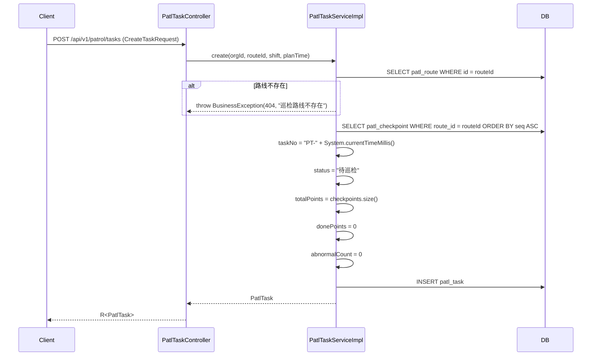

# 巡检流程参考 (patrol-flow-reference)

> 生成日期: 2026-07-24 | 数据源: `PatlRouteServiceImpl` + `PatlTaskServiceImpl` + Controller 源码 + Flyway V12
> 前端路径: `qms-web/src/api/modules/patrol/`
> 权限码前缀: `patl.route.*` / `patl.task.*`

---

## 1. 数据模型

### 1.1 实体关系

```
ops.patl_route (巡检路线)
  └── ops.patl_checkpoint (巡检点位, FK route_id)
       └── ops.patl_check_item (检查项, FK checkpoint_id)

ops.patl_task (巡检任务, FK route_id)
  └── ops.patl_record (巡检记录, FK task_id)
       └── ops.patl_abnormal (巡检异常, FK record_id / task_id)
```

### 1.2 实体字段

| 表 | 关键字段 | 说明 |
|----|---------|------|
| `patl_route` | `route_code`, `route_name`, `proc_name`, `freq`, `status` | 路线配置; `status` 取值 `启用`/`停用` |
| `patl_checkpoint` | `seq`, `point_name`, `location`, `need_photo` | 点位; `need_photo` 默认 `false` |
| `patl_check_item` | `seq`, `item_name`, `check_type`, `std_value`, `enum_values`, `is_required` | 检查项; `check_type` 取值 `enum`/`numeric`/`text`; `is_required` 默认 `true` |
| `patl_task` | `task_no`, `route_id`, `shift`, `plan_time`, `status`, `total_points`, `done_points`, `abnormal_count` | 任务; `status` DB 定义 4 态 → 实际实现 2 态 |
| `patl_record` | `checkpoint_id`, `checkpoint_name`, `result`, `check_time`, `operator_id`, `photo_ref`, `item_results` | 记录; `result` 取值 `正常`/`异常`; `item_results` JSONB 字段预留但未使用 |
| `patl_abnormal` | `checkpoint_name`, `description`, `severity`, `status`, `d8_id`, `ncm_record_id` | 异常; `severity` 取值 `严重`/`一般`; `status` 取值 `待处理`/`已转NCM`/`已关闭` |

---

## 2. 路线设计流程

### 2.1 创建路线 (三级嵌套, 单事务)

`POST /api/v1/patrol/routes` → `PatlRouteController.create()` → `PatlRouteServiceImpl.create(route, checkpoints)`

```mermaid
sequenceDiagram
    participant Client
    participant Controller as PatlRouteController
    participant Service as PatlRouteServiceImpl
    participant DB

    Client->>Controller: POST /api/v1/patrol/routes (CreateRouteRequest)
    Controller->>Controller: 组装 PatlRoute + List<CheckpointVo>
    Controller->>Service: create(route, checkpoints)
    Service->>Service: route.status 默认 "启用"
    Service->>DB: INSERT patl_route
    loop 每个点位
        Service->>Service: cp.orgId = route.orgId; cp.routeId = route.id; cp.needPhoto 默认 false
        Service->>DB: INSERT patl_checkpoint
        loop 每个检查项
            Service->>Service: item.orgId = route.orgId; item.checkpointId = cp.id; item.isRequired 默认 true; item.checkType 默认 "enum"
            Service->>DB: INSERT patl_check_item
        end
    end
    Service-->>Controller: route
    Controller-->>Client: R<PatlRoute>
```

### 2.2 查询路线详情

`GET /api/v1/patrol/routes/{id}` → `PatlRouteServiceImpl.get(id)` 返回 `PatlRouteVo`:
- `route`: PatlRoute
- `checkpoints`: `List<CheckpointVo>` (每个 CheckpointVo 含 `checkpoint` + `items`，按 `seq ASC` 排序)

### 2.3 更新路线

`PUT /api/v1/patrol/routes/{id}` → `PatlRouteServiceImpl.update(route)` 仅更新 `patl_route` 主表字段，不更新点位和检查项。

### 2.4 删除路线 (级联)

`DELETE /api/v1/patrol/routes/{id}` → `PatlRouteServiceImpl.delete(id)`:
1. 查 `patl_checkpoint` WHERE `route_id = id`
2. 遍历每个点位，删除其 `patl_check_item` WHERE `checkpoint_id = cp.id`
3. 删除所有 `patl_checkpoint` WHERE `route_id = id`
4. 删除 `patl_route` WHERE `id = id`

> 注意: 使用的是 MyBatis-Plus `delete()` (物理删除)，不是 `BaseEntity.isDeleted` 的软删除。`patl_check_item` 不继承 `BaseEntity`，无软删除能力。

---

## 3. 任务生成流程

`POST /api/v1/patrol/tasks` → `PatlTaskController.create()` → `PatlTaskServiceImpl.create(orgId, routeId, shift, planTime)`



关键行为:
- `task_no` 格式: `PT-{System.currentTimeMillis()}` (如 `PT-1753430400000`)
- `planTime`: 从 ISO 字符串 `LocalDateTime.parse(planTime)` 解析；若为 `null` 或空则跳过
- 仅记录 `totalPoints`，不预创建 `patl_record` 行 (记录在 submitRecord 时动态创建)

---

## 4. 任务执行流程

### 4.1 提交点位结果

`POST /api/v1/patrol/tasks/{id}/records` → `PatlTaskController.submitRecord()` → `PatlTaskServiceImpl.submitRecord(taskId, checkpointId, checkpointName, result, remark, operatorId)`

```mermaid
sequenceDiagram
    participant Client
    participant Service as PatlTaskServiceImpl
    participant DB

    Client->>Service: submitRecord(taskId, cpId, cpName, result, remark, operatorId)
    Service->>DB: SELECT patl_task WHERE id = taskId
    alt 任务不存在
        Service-->>Client: throw BusinessException(404, "巡检任务不存在")
    end
    alt status == "已完成"
        Service-->>Client: throw BusinessException(400, "任务已完成,无法继续提交")
    end
    Service->>DB: INSERT patl_record (taskId, cpId, cpName, result, remark, operatorId, checkTime=now())
    alt result == "异常"
        Service->>DB: INSERT patl_abnormal (taskId, recordId, cpName, description=remark, severity="一般", status="待处理")
        Service->>Service: task.abnormalCount += 1
    end
    Service->>Service: task.donePoints += 1
    alt donePoints >= totalPoints
        Service->>Service: task.status = "已完成"; task.finishTime = now()
    end
    Service->>DB: UPDATE patl_task
    Service-->>Client: void
```

### 4.2 手动关闭任务

`POST /api/v1/patrol/tasks/{id}/close` → `PatlTaskServiceImpl.close(taskId)`:
- 将 `status` 设为 `"已完成"`，`finishTime` 设为 `now()`
- 不检查 `donePoints >= totalPoints`，任何状态均可强制关闭

### 4.3 任务状态机

```mermaid
stateDiagram-v2
    [*] --> "待巡检": createTask()
    "待巡检" --> "待巡检": submitRecord()<br/>done < total
    "待巡检" --> "已完成": submitRecord()<br/>done >= total
    "待巡检" --> "已完成": close() 手动关闭
    "进行中" --> "已完成": close() 手动关闭
    "超时" --> "已完成": close() 手动关闭
```

> **后端已知缺口**: DB schema 定义了 4 种状态 (`待巡检`/`进行中`/`已完成`/`超时`)，但 `PatlTaskServiceImpl` 只实现了 2 种 (`待巡检`/`已完成`)。`进行中` 和 `超时` 状态从未被设置。`close()` 方法不区分当前状态，统一设为 `已完成`。

---

## 5. 异常处理流程

### 5.1 异常创建

在 `submitRecord()` 中，当 `result == "异常"` 时自动创建 `patl_abnormal`:
- `severity`: 固定为 `"一般"` (不可选 `"严重"`)
- `status`: 固定为 `"待处理"`
- `description`: 取 `remark` 字段
- `d8_id` / `ncm_record_id`: 不设置 (始终为 `null`)

### 5.2 关闭异常

`POST /api/v1/patrol/abnormals/{id}/close` → `PatlTaskServiceImpl.closeAbnormal(id, handleRemark)`:
- `status` → `"已关闭"`
- `handleRemark` ← 请求参数
- `handledBy` ← `currentOperator()` (当前用户ID)
- `handledAt` ← `now()`

### 5.3 异常状态机

```mermaid
stateDiagram-v2
    [*] --> "待处理": submitRecord()<br/>result="异常"
    "待处理" --> "已关闭": closeAbnormal()<br/>填handleRemark
    "待处理" --> "已转NCM": (未实现)
    "待处理" --> "已转8D": (未实现)
```

> **后端已知缺口**:
> - `已转NCM` 状态从未设置 (`ncm_record_id` 字段始终为 `null`)
> - `已转8D` 状态从未设置 (`d8_id` 字段始终为 `null`)
> - 异常转 NCM/8D 的联动逻辑未实现
> - `severity` 创建时固定为 `"一般"`，无升级为 `"严重"` 的路径

---

## 6. 接口清单

### 6.1 PatlRouteController (`/api/v1/patrol/routes`)

| # | 方法 | 路径 | 权限码 | 请求体 | 响应 | 说明 |
|---|------|------|--------|--------|------|------|
| 1 | GET | `/api/v1/patrol/routes` | `patl.route.list` | -- | `R<List<PatlRoute>>` | 路线列表 |
| 2 | GET | `/api/v1/patrol/routes/{id}` | `patl.route.list` | `{id}` | `R<PatlRouteVo>` | 路线详情(含点位+检查项) |
| 3 | POST | `/api/v1/patrol/routes` | `patl.route.create` | `CreateRouteRequest` | `R<PatlRoute>` | 创建路线(三级嵌套) |
| 4 | PUT | `/api/v1/patrol/routes/{id}` | `patl.route.create` | `PatlRoute` | `R<Void>` | 更新路线(仅主表) |
| 5 | DELETE | `/api/v1/patrol/routes/{id}` | `patl.route.delete` | `{id}` | `R<Void>` | 删除路线(级联) |

### 6.2 PatlTaskController (`/api/v1/patrol/tasks`)

| # | 方法 | 路径 | 权限码 | 请求体 | 响应 | 说明 |
|---|------|------|--------|--------|------|------|
| 1 | GET | `/api/v1/patrol/tasks` | `patl.task.list` | -- | `R<List<PatlTask>>` | 任务列表 |
| 2 | GET | `/api/v1/patrol/tasks/{id}` | `patl.task.list` | `{id}` | `R<PatlTaskVo>` | 任务详情(含记录) |
| 3 | POST | `/api/v1/patrol/tasks` | `patl.task.create` | `CreateTaskRequest` | `R<PatlTask>` | 按路线生成任务 |
| 4 | POST | `/api/v1/patrol/tasks/{id}/records` | `patl.task.record` | `SubmitRecordRequest` | `R<Void>` | 提交点位结果 |
| 5 | POST | `/api/v1/patrol/tasks/{id}/close` | `patl.task.close` | `{id}` | `R<Void>` | 关闭任务 |

### 6.3 PatlAbnormalController (`/api/v1/patrol/abnormals`)

| # | 方法 | 路径 | 权限码 | 请求体 | 响应 | 说明 |
|---|------|------|--------|--------|------|------|
| 1 | GET | `/api/v1/patrol/abnormals` | `patl.task.list` | -- | `R<List<PatlAbnormal>>` | 异常列表 |
| 2 | POST | `/api/v1/patrol/abnormals/{id}/close` | `patl.task.create` | `CloseAbnormalRequest` | `R<Void>` | 关闭异常 |

### 6.4 请求体 DTO

**CreateRouteRequest**:
| 字段 | 类型 | 必填 | 说明 |
|------|------|------|------|
| orgId | String | 是 | 组织ID |
| routeCode | String | 是 | 路线编码 |
| routeName | String | 是 | 路线名称 |
| procName | String | 否 | 关联工序 |
| freq | String | 否 | 频次 (1次/班/1次/天/1次/周) |
| status | String | 否 | 默认 "启用" |
| checkpoints | CheckpointInput[] | 否 | 点位列表 |

`CheckpointInput`: `seq`(Short), `pointName`, `location`, `needPhoto`(Boolean), `items`(ItemInput[])
`ItemInput`: `seq`(Short), `itemName`, `checkType`, `stdValue`, `enumValues`, `isRequired`(Boolean)

**CreateTaskRequest**:
| 字段 | 类型 | 必填 | 说明 |
|------|------|------|------|
| orgId | String | 是 | 组织ID |
| routeId | String | 是 | 路线ID |
| shift | String | 否 | 班次 (早班/中班/晚班) |
| planTime | String | 否 | 计划时间 (ISO datetime) |

**SubmitRecordRequest**:
| 字段 | 类型 | 必填 | 说明 |
|------|------|------|------|
| checkpointId | String | 是 | 点位ID |
| checkpointName | String | 是 | 点位名称快照 |
| result | String | 是 | 正常/异常 |
| remark | String | 否 | 备注 |

**CloseAbnormalRequest**:
| 字段 | 类型 | 必填 | 说明 |
|------|------|------|------|
| handleRemark | String | 是 | 处理备注 |

---

## 7. 完整 API 调用链

### 7.1 路线设计 → 任务生成 → 执行 → 异常处理

```
1. POST   /api/v1/patrol/routes             创建路线(含点位+检查项)
2. GET    /api/v1/patrol/routes/{id}         确认路线详情
3. POST   /api/v1/patrol/tasks               按路线生成任务 (taskNo="PT-...")
4. GET    /api/v1/patrol/tasks/{id}          查看任务详情(含记录)
5. POST   /api/v1/patrol/tasks/{id}/records  提交点位1结果 (正常)
6. POST   /api/v1/patrol/tasks/{id}/records  提交点位2结果 (异常 → 自动创建 patl_abnormal)
7. POST   /api/v1/patrol/tasks/{id}/records  提交点位3结果 (正常, done==total → 自动已完成)
8. GET    /api/v1/patrol/abnormals           查看异常列表
9. POST   /api/v1/patrol/abnormals/{id}/close 关闭异常 (填handleRemark)
```

### 7.2 强制关闭流程

```
POST /api/v1/patrol/tasks/{id}/close         强制关闭任务 (任意状态 → 已完成)
```

---

## 8. 后端已知缺口汇总

| # | 缺口 | 位置 | 影响 |
|---|------|------|------|
| 1 | 任务状态机仅实现 2 态 | `PatlTaskServiceImpl` | DB 定义 `进行中`/`超时` 从未设置 |
| 2 | 异常转 NCM 未实现 | `PatlTaskServiceImpl` | `ncm_record_id` 字段始终为 `null` |
| 3 | 异常转 8D 未实现 | `PatlTaskServiceImpl` | `d8_id` 字段始终为 `null` |
| 4 | `已转NCM` 状态从未设置 | `PatlTaskServiceImpl` | `PatlAbnormal.status` 只能 `待处理` → `已关闭` |
| 5 | 拍照功能未通 | `PatlTaskServiceImpl.submitRecord()` | `photo_ref` 字段从未写入 |
| 6 | 检查项级判定未通 | `PatlTaskServiceImpl.submitRecord()` | `item_results` JSONB 字段从未填充 |
| 7 | `severity` 固定为 `"一般"` | `PatlTaskServiceImpl.submitRecord()` | 无法标记严重异常 |
| 8 | 路线更新仅更新主表 | `PatlRouteServiceImpl.update()` | 点位和检查项的修改需删除重建 |
| 9 | `patl_check_item` 无审计字段 | 实体定义 | 不继承 `BaseEntity`，无 `createdAt`/`updatedAt`/软删除 |
| 10 | `patl_record` 无审计字段 | 实体定义 | 不继承 `BaseEntity`，无 `createdAt`/`updatedAt`/软删除 |