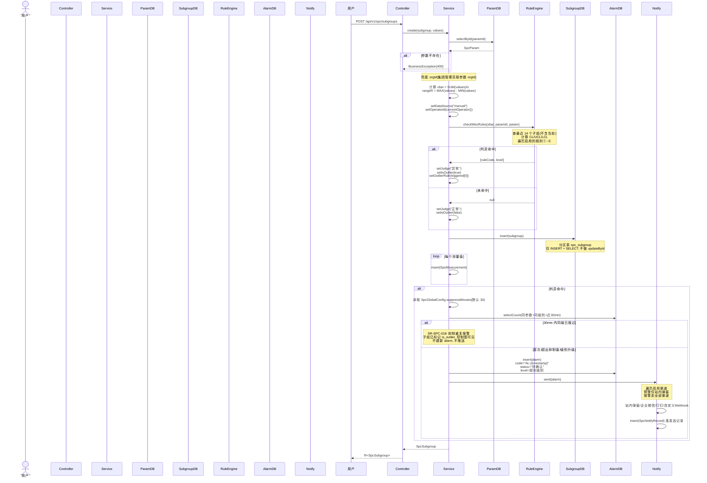
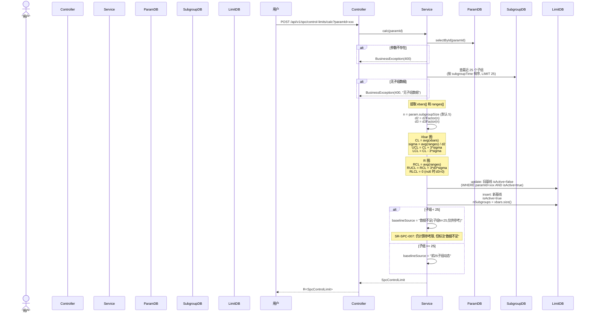
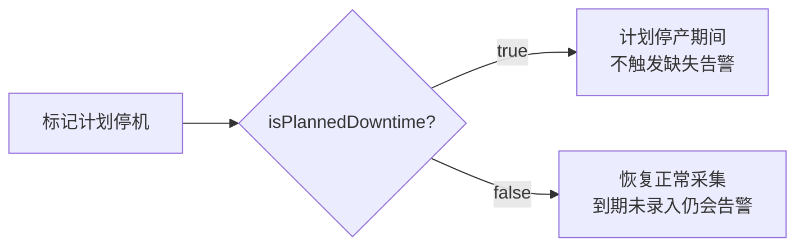

# SPC 过程控制业务流程参考

> 生成日期: 2026-07-24 | 数据源: Service 源码 + Controller 源码 + SRS 流程图手册
> 后端包: `com.konli.qms.service.spc.impl` | 10 个 Controller, 33 个 API 端点

---

## 1. 子组采集流程时序图

核心入口: `SpcSubgroupServiceImpl.create()` (line 177)



### 采集方式

| 方式 | 入口 | 说明 |
|------|------|------|
| 手动录入 | `POST /api/v1/spc/subgroups` | 检验员手动录入一组测量值 |
| 采集任务 | `SpcCollectTask` 到期后触发 | 系统按采集频率 `nextDueAt` 到期提醒 |
| 定时扫描 | `SpcCollectTaskServiceImpl.scheduledScanOverdue()` | 每 60 秒扫描逾期未录入任务,自动标记缺失 |

### 联动场景

- **FIA -> SPC**: `createInNewTx()` (line 171) 使用 `REQUIRES_NEW` 独立事务, FIA 主事务失败时不回滚已创建的 SPC 子组
- **SPC -> 8D**: `POST /api/v1/spc/alarms/{id}/launch-8d` 一键发起 8D 整改

---

## 2. 告警状态机

```mermaid
stateDiagram-v2
    [*] --> "待确认": 判异命中 + 通过抑制检查
    state "待确认" {
        [*] --> "等待处置"
        "等待处置" --> "一键发起8D": POST /alarms/{id}/launch-8d
    }
    "待确认" --> "已关闭": close(reason, disposition)<br/>必填 closeReason + disposition<br/>自动填 closedBy + closedAt
    note right of "待确认"
        SR-SPC-018: 30min 抑制窗
        同参数+同级别已报过 → 抑制
        级别升级(预警→报警) → 不抑制
    end note
    note right of "已关闭"
        SR-SPC-017: 关闭必须填写
        closeReason 和 disposition
        否则阻止关闭
    end note
```

### 告警抑制规则 (SR-SPC-018)

实现位置: `SpcSubgroupServiceImpl.create()` lines 241-283

```
1. 默认抑制窗口: 30 分钟 (SpcGlobalConfig.suppressMinutes)
2. 仅"同级"重复抑制: 预警→预警 或 报警→报警 抑制
3. 级别升级视为新告警: 预警→报警 不抑制,创建新告警
4. 抑制时: 不建新 alarm, 不推送通知, 但子组已标记 is_outlier=true, 控制图可见
```

### 告警关闭校验 (SR-SPC-017)

实现位置: `SpcAlarmServiceImpl.close()` lines 26-47

| 校验项 | 规则 |
|--------|------|
| 告警存在 | `alarm == null` → 400 "告警不存在" |
| 状态 | 必须为 `"待确认"`, 否则 400 "告警状态不允许关闭" |
| closeReason | 不能为空, 否则 400 "关闭原因不能为空" |
| disposition | 不能为空, 否则 400 "处置措施不能为空" |

### 一键发起 8D (SPC → NCM 联动)

实现位置: `SpcAlarmController.launch8d()` lines 43-56

```
POST /api/v1/spc/alarms/{id}/launch-8d
  → 创建 Qms8dReport:
    source = "SPC报警"
    sourceRefId = alarm.code (或 alarm.id)
    issue = "SPC{规则编号}报警:{参数名}"
    severity = 报警→"高", 预警→"中"
    team = "质量团队"
  → Ncm8dService.create(report)
```

---

## 3. 控制限计算流程

实现位置: `SpcControlLimitServiceImpl.calc()` lines 54-124



### d2 因子表 (控制图常数)

实现位置: `SpcControlLimitServiceImpl.d2Factor()` lines 133-146

| n | 2 | 3 | 4 | 5 | 6 | 7 | 8 | 9 | 10 |
|---|----|----|----|----|----|----|----|----|-----|
| d2 | 1.128 | 1.693 | 2.059 | 2.326 | 2.534 | 2.704 | 2.847 | 2.970 | 3.078 |

默认 n=5 → d2=2.326

### d3 因子表 (R 图下限因子)

实现位置: `SpcControlLimitServiceImpl.d3Factor()` lines 149-157

| n | 2-6 | 7 | 8 | 9 | 10 |
|---|------|-----|-----|-----|-----|
| d3 | 0.0 | 0.076 | 0.136 | 0.184 | 0.223 |

n≤6 时 d3=0, RLCL=0

### 控制图数据查询

实现位置: `SpcSubgroupServiceImpl.getControlChart()` lines 72-115

`GET /api/v1/spc/control-chart?paramId=xxx&startTime=&endTime=`

返回 `ControlChartVo`:
- `subgroups`: 子组时间序列
- `limit`: 当前激活控制限 (isActive=true)
- `marks`: 异常点标记列表 `[{i, rule, level}]`，用于前端控制图着色

---

## 4. 能力指数流程

实现位置: `SpcCapabilityServiceImpl.compute()` (private) + `calc()` (public) lines 104-178

```mermaid
flowchart TD
    A["POST /api/v1/spc/capability/calc<br/>?paramId=xxx"] --> B["查询 SpcParam"]
    B --> C["查询所有子组<br/>按 subgroupTime 倒序"]
    C --> D{"子组是否为空?"}
    D -->|"是"| E["BusinessException: 无子组数据"]
    D -->|"否"| F["计算 mean = avg&#40;xbars&#41;"]
    F --> G["sigmaWithin = avg&#40;ranges&#41; / d2"]
    F --> H["sigmaOverall = sqrt&#40;sum&#40;&#40;xi-mean&#41;²&#41; / &#40;N-1&#41;&#41;"]
    G --> I["CPK = min&#40;USL-mean, mean-LSL&#41; / &#40;3 × sigmaWithin&#41;"]
    H --> J["PPK = min&#40;USL-mean, mean-LSL&#41; / &#40;3 × sigmaOverall&#41;"]
    I --> K{"样本数 N?"}
    J --> K
    K -->|"N < 10"| L["CPK=null, PPK=null<br/>level='样本过少,无法计算'"]
    K -->|"10 ≤ N < 30"| M["仍计算 CPK/PPK<br/>level='数据不足,仅供参考'"]
    K -->|"N ≥ 30"| N{"CPK ≥ 1.33?"}
    N -->|"是"| O["level='充足'"]
    N -->|"否"| P{"CPK ≥ 1.0?"}
    P -->|"是"| Q["level='尚可'"]
    P -->|"否"| R["level='不足'"]
    L --> S["upsert SpcCapability<br/>按 paramId+periodType+periodValue 去重"]
    M --> S
    O --> S
    Q --> S
    R --> S
    S --> T["联动供应商绩效<br/>UPDATE sqm_supplier_performance<br/>SET quality_score = CPK<br/>WHERE param_id = ? AND period = ?"]
```



### 能力分级标准

| 等级 | Cpk 范围 | 判定 | 来源 |
|------|----------|------|------|
| 充足 | Cpk >= 1.33 | 过程能力充分 | `SpcGlobalConfig.cpkSufficient` (默认 1.33) |
| 尚可 | 1.0 <= Cpk < 1.33 | 过程能力尚可, 需关注 | `SpcGlobalConfig.cpkAcceptable` (默认 1.00) |
| 不足 | Cpk < 1.0 | 过程能力不足, 需改进 | -- |
| 样本过少 | N < 10 | 无法计算 | SR-SPC-013 |
| 数据不足 | 10 <= N < 30 | 仅供参考 | SR-SPC-013 |

### Cpk vs Ppk 区别

| 指标 | 标准差 | 含义 |
|------|--------|------|
| Cpk | sigmaWithin = avg(R) / d2 | 组内变异 (短期能力) |
| Ppk | sigmaOverall = 样本标准差 | 整体变异 (长期能力) |

---

## 5. WECO 8 规则判异流程

实现位置: `SpcSubgroupServiceImpl.checkWecRules()` lines 293-483

```mermaid
flowchart TD
    A["checkWecRules&#40;currentXbar, paramId, param&#41;"] --> B["查最近 14 个子组<br/>按 subgroupTime 倒序 LIMIT 14"]
    B --> C{"历史子组为空?"}
    C -->|"是"| D["return null &#40;无历史数据,不判异&#41;"]
    C -->|"否"| E["计算 CL/UCL/LCL<br/>CL = avg&#40;xbars&#41;<br/>sigma = avg&#40;ranges&#41; / d2<br/>UCL = CL + 3σ<br/>LCL = CL - 3σ"]
    E --> F["查启用规则: isEnabled=true"]
    F --> G["按时间正序排列历史子组"]
    G --> H["初始化 winner = null"]
    H --> I{"遍历每条规则"}
    I -->|"① 1点超出3σ"| J1{"currentXbar > UCL<br/>或 < LCL?"}
    J1 -->|"是"| K1["触发"]
    J1 -->|"否"| L1["未触发"]
    I -->|"② 3点中2点在A区"| J2{"最近2历史+当前<br/>≥2点超出2σ同侧?"}
    J2 -->|"是"| K2["触发"]
    J2 -->|"否"| L2["未触发"]
    I -->|"③ 5点中4点在B区外"| J3{"最近4历史+当前<br/>≥4点超出1σ同侧?"}
    J3 -->|"是"| K3["触发"]
    J3 -->|"否"| L3["未触发"]
    I -->|"④ 8点在中心线一侧"| J4{"最近7历史+当前<br/>全在CL同侧?"}
    J4 -->|"是"| K4["触发"]
    J4 -->|"否"| L4["未触发"]
    I -->|"⑤ 6点递增或递减"| J5{"最近5历史+当前<br/>全递增或全递减?"}
    J5 -->|"是"| K5["触发"]
    J5 -->|"否"| L5["未触发"]
    I -->|"⑥ 14点交替上下"| J6{"最近13历史+当前<br/>连续交替升降?"}
    J6 -->|"是"| K6["触发"]
    J6 -->|"否"| L6["未触发"]
    I -->|"⑦ 15点在C区"| J7{"最近14历史+当前<br/>全在1σ内?"}
    J7 -->|"是"| K7["触发"]
    J7 -->|"否"| L7["未触发"]
    I -->|"⑧ 8点在B区外"| J8{"最近7历史+当前<br/>全在1σ外?"}
    J8 -->|"是"| K8["触发"]
    J8 -->|"否"| L8["未触发"]
    K1 --> M{"规则级别?"}
    K2 --> M
    K3 --> M
    K4 --> M
    K5 --> M
    K6 --> M
    K7 --> M
    K8 --> M
    M -->|"报警"| N["return &#91;ruleCode, '报警'&#93;<br/>立即返回,不继续遍历"]
    M -->|"预警"| O{"winner == null?"}
    O -->|"是"| P["winner = &#91;ruleCode, '预警'&#93;<br/>继续遍历找报警"]
    O -->|"否"| Q["继续遍历"]
    L1 --> Q
    L2 --> Q
    L3 --> Q
    L4 --> Q
    L5 --> Q
    L6 --> Q
    L7 --> Q
    L8 --> Q
    Q --> I
    P --> I
    N --> R["返回结果: 判异命中"]
    Q --> S{"遍历结束?"}
    S -->|"是"| T{"winner?"}
    T -->|"有预警"| U["return winner"]
    T -->|"null"| V["return null &#40;未命中&#41;"]
```



### WECO 8 规则明细

| 编号 | 规则名称 | 判异条件 | 所需历史点数 | 级别 | 默认启用 |
|------|----------|----------|-------------|------|----------|
| ① | 1 点超出 3σ | 当前点超出 UCL 或 LCL | 0 | **报警** | 是 |
| ② | 3 点中 2 点在 A 区 | 最近 3 点中 2 点超出 2σ 同侧 | 2 | **报警** | 否 |
| ③ | 5 点中 4 点在 B 区外 | 最近 5 点中 4 点超出 1σ 同侧 | 4 | **报警** | 否 |
| ④ | 8 点在中心线一侧 | 连续 8 点均在 CL 同侧 | 7 | 预警 | 是 |
| ⑤ | 6 点递增或递减 | 连续 6 点单调上升或下降 | 5 | 预警 | 是 |
| ⑥ | 14 点交替上下 | 连续 14 点交替升降 | 13 | 预警 | 否 |
| ⑦ | 15 点在 C 区 | 连续 15 点均在 1σ 内 | 14 | 预警 | 是 |
| ⑧ | 8 点在 B 区外 | 连续 8 点均在 1σ 外 | 7 | 预警 | 否 |

> 默认启用规则: `"①,④,⑤"` (SpcGlobalConfig.chartAutoRules)

### 判异优先级 (SR-SPC-015)

```
同时触发预警和报警时 → 仅返回报警 (高级别优先)
遍历顺序: 按规则表查询顺序, 报警立即返回, 预警仅记录继续找
```

---

## 6. 采集任务流程

实现位置: `SpcCollectTaskServiceImpl` lines 1-138

```mermaid
flowchart TD
    A["创建采集任务"] --> B["POST /api/v1/spc/collect-tasks"]
    B --> C["status='待采集'<br/>isPlannedDowntime=false"]
    C --> D["定时扫描<br/>@Scheduled&#40;fixedDelay=60000&#41;"]
    D --> E{"nextDueAt < now<br/>AND status='待采集'<br/>AND isPlannedDowntime=false?"}
    E -->|"否"| D
    E -->|"是"| F["markMissing&#40;id, reason&#41;"]
    F --> G{"isPlannedDowntime?"}
    G -->|"是"| H["BusinessException: 计划停产期间不告警"]
    G -->|"否"| I{"status 已是 '缺失'?"}
    I -->|"是"| J["幂等: 已标记, 跳过"]
    I -->|"否"| K["status='缺失'"]
    K --> L["写 notification_log<br/>biz_type='SPC_COLLECT_MISSING'<br/>receiver='班组长'<br/>level='告警'"]
    L --> M["通知班组长: 安排补录"]
```



### 计划停机标记

`POST /api/v1/spc/collect-tasks/{id}/downtime`



### 手动标记缺失

`POST /api/v1/spc/collect-tasks/{id}/mark-missing?reason=xxx`

- 计划停产 (`isPlannedDowntime=true`) 时拒绝标记: 400 "该采集任务已标记计划停产,停产期间不触发缺失告警"
- 非停产时: status='缺失', 写通知日志给班组长

---

## 7. 通知渠道流程

实现位置: `SpcNotifyChannelServiceImpl.send()` lines 55-91

```mermaid
flowchart TD
    A["SpcAlarm 判异命中"] --> B["send&#40;alarm&#41;"]
    B --> C["查启用渠道<br/>isEnabled=true<br/>orgId=告警orgId OR null"]
    C --> D{"告警级别?"}
    D -->|"预警"| E["过滤: 仅保留 '站内弹窗' 渠道"]
    D -->|"报警"| F["保留全部启用渠道"]
    E --> G{"渠道为空?"}
    F --> G
    G -->|"是"| H["结束"]
    G -->|"否"| I["遍历渠道"]
    I --> J{"渠道类型?"}
    J -->|"站内弹窗"| K["无需外部投递<br/>WebSocket 已推送"]
    J -->|"企业微信/钉钉/自定义Webhook"| L["sendWebhook&#40;&#41;"]
    L --> M{"渠道类型?"}
    M -->|"钉钉"| N["msgtype: text<br/>content: message"]
    M -->|"企业微信/自定义"| O["msgtype: markdown<br/>content: Markdown 格式"]
    N --> P["POST webhook URL<br/>timeout 5s"]
    O --> P
    P --> Q{"HTTP status?"}
    Q -->|"< 400"| R["rec.status='SENT'<br/>rec.sentAt=now"]
    Q -->|">= 400"| S["rec.status='FAILED'<br/>rec.error=错误信息"]
    K --> T["rec.status='SENT'"]
    R --> U["insert SpcNotifyRecord"]
    S --> U
    T --> U
```



### 通知渠道类型

| 渠道 | 投递方式 | 预警 | 报警 |
|------|----------|------|------|
| 站内弹窗 | WebSocket 推送 (无需 HTTP 投递) | 是 | 是 |
| 企业微信 | POST webhook (Markdown 格式) | 否 | 是 |
| 钉钉 | POST webhook (text 格式) | 否 | 是 |
| 自定义Webhook | POST webhook (Markdown 格式) | 否 | 是 |

### 通知消息模板

```
[SPC异常报警] 参数:{paramName} 规则:{triggeredRule} 级别:{level} 当前值:{currentValue} 时间:{alarmTime} 告警号:{code}
```

---

## 8. 关键业务规则汇总

### 分区表约束

| 规则 | 说明 |
|------|------|
| `spc_subgroup` 为分区表 | 仅 INSERT + SELECT, 不做 `updateById` |
| 如需更新 | 用 `LambdaUpdateWrapper` 带分区键 |
| 判异在插入前完成 | `checkWecRules()` 在 `insert(subgroup)` 之前调用, 避免分区表 update |

### 告警抑制 (SR-SPC-018)

| 参数 | 默认值 | 来源 |
|------|--------|------|
| 抑制窗口 | 30 分钟 | `SpcGlobalConfig.suppressMinutes` |
| 抑制范围 | 同参数 + 同级别 | `SpcAlarm.paramId` + `SpcAlarm.level` |
| 级别升级 | 不抑制, 创建新告警 | 预警→报警 |
| 子组标记 | 抑制时仍标记 `is_outlier=true` | 控制图可见 |

### 基线计算 (SR-SPC-007)

| 条件 | baselineSource | 说明 |
|------|--------|------|
| 子组 >= 25 | "前25子组动态" | 基线正式建立 |
| 子组 < 25 | "数据不足(子组N<25,仅供参考)" | 仍计算参考限, 但标注数据不足 |

### 能力指数 (SR-SPC-013)

| 样本数 | 行为 |
|--------|------|
| N < 10 | CPK=null, PPK=null, level="样本过少,无法计算" |
| 10 <= N < 30 | 仍计算, level="数据不足,仅供参考" |
| N >= 30 | 正常分级 (充足/尚可/不足) |

### 全局配置默认值

| 配置项 | 默认值 | 对应字段 |
|--------|--------|----------|
| 基线模式 | "前25子组动态" | `baselineMode` |
| 默认子组大小 | 5 | `defaultSubgroupSize` |
| 默认启用规则 | "①,④,⑤" | `chartAutoRules` |
| Cpk 周期 | "month" | `cpkPeriod` |
| Cpk 充足阈值 | 1.33 | `cpkSufficient` |
| Cpk 尚可阈值 | 1.00 | `cpkAcceptable` |
| 规格来源 | "检验标准库" | `specSource` |
| 告警级别 | "提醒" | `alertLevel` |
| 抑制窗口(分钟) | 30 | `suppressMinutes` |

### 控制图 marks 异常点标注

实现位置: `SpcSubgroupServiceImpl.getControlChart()` lines 94-108

```java
// 遍历子组, 把 is_outlier=true 的映射为 ControlChartMark
for (int idx = 0; idx < subgroups.size(); idx++) {
    SpcSubgroup sg = subgroups.get(idx);
    if (Boolean.TRUE.equals(sg.getIsOutlier()) && sg.getOutlierRule() != null) {
        ControlChartMark mk = new ControlChartMark();
        mk.setI(idx);           // 子组索引
        mk.setRule(sg.getOutlierRule());  // 规则编号
        mk.setLevel(ruleLevelMap.get(sg.getOutlierRule()));  // 预警/报警
        marks.add(mk);
    }
}
```

前端根据 `marks` 数组在控制图上标注异常点 (着色/标记)。

---

## 附录: 完整 API 接口清单

| # | Controller | 端点 | 权限码 |
|---|-----------|------|--------|
| 1 | SpcParamController | GET/POST/PUT/DELETE `/api/v1/spc/params` | `spc.param.*` |
| 2 | SpcSubgroupController | GET/POST `/api/v1/spc/subgroups` | `spc.subgroup.*` |
| 3 | SpcAlarmController | GET `/api/v1/spc/alarms`, POST `/{id}/close`, `/{id}/launch-8d` | `spc.alarm.*` |
| 4 | SpcControlLimitController | GET `/api/v1/spc/control-limits`, POST `/calc` | `spc.param.list` |
| 5 | SpcRuleController | GET `/api/v1/spc/rules`, PUT `/{id}`, GET `/triggers` | `spc.rule.list` |
| 6 | SpcCapabilityController | GET/POST `/api/v1/spc/capability`, GET `/trend`, `/supplier-cpk` | `spc.capability.list` |
| 7 | SpcChartController | GET `/api/v1/spc/control-chart`, `/histogram`, `/dashboard` | `spc.param.list` |
| 8 | SpcCollectTaskController | GET/POST `/api/v1/spc/collect-tasks`, POST `/{id}/downtime`, `/{id}/mark-missing`, `/scan-missing` | `spc.subgroup.create` |
| 9 | SpcNotifyChannelController | GET `/api/v1/spc/notify-channels`, PUT `/{id}/toggle`, GET `/records` | `spc.param.list` |
| 10 | SpcGlobalConfigController | GET/PUT `/api/v1/spc/global-config` | `spc.param.list` |