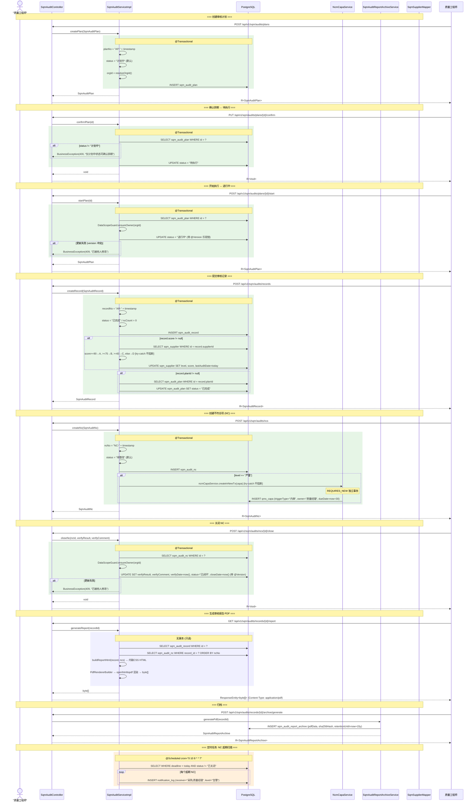
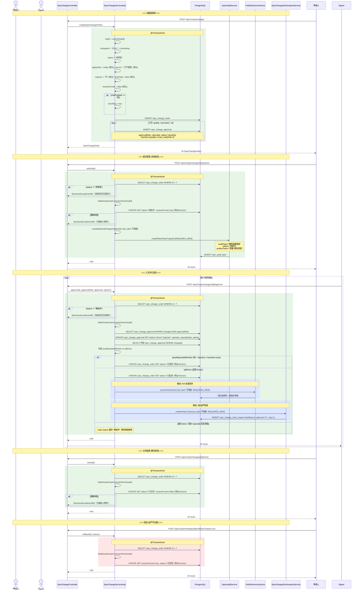
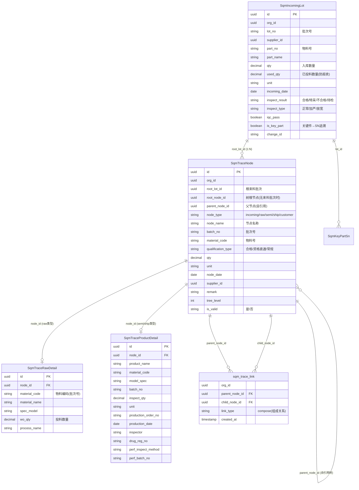
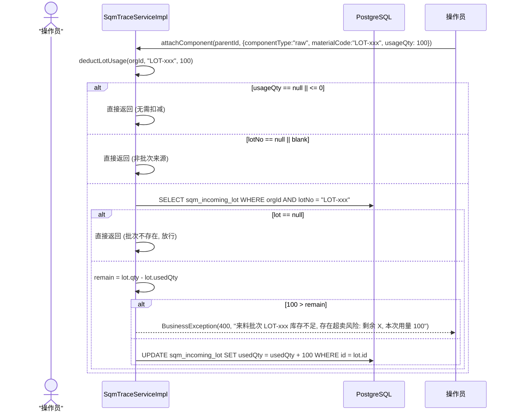

# SQM 供应商质量管理 — 业务流程参考文档

> 基于后端源码 (Service/Controller/Entity) 生成，2026-07-24 更新。
> 覆盖 5 个核心子模块的时序图、状态机、接口调用链与联动规则。
> 所有方法名、枚举值、状态值均直接引用 `com.konli.qms.service.sqm.impl.*` 源码。

---

## 目录

1. [来料异常整改流程](#1-来料异常整改流程)
2. [供应商审核流程](#2-供应商审核流程)
3. [物料变更 ECN 会签流程](#3-物料变更-ecn-会签流程)
4. [FMEA 风险闭环流程](#4-fmea-风险闭环流程)
5. [追溯流程](#5-追溯流程)
6. [跨模块联动总览](#6-跨模块联动总览)

---

## 1. 来料异常整改流程

### 1.1 核心源码

| 项目 | 类/文件 |
|------|---------|
| Service | `SqmAbnormalServiceImpl` |
| Controller | `SqmAbnormalController` |
| Entity | `SqmIncomingAbnormal` (`ops.sqm_incoming_abnormal`) |
| 子表 | `SqmAbnormalMeasure` (`ops.sqm_abnormal_measure`) |
| 子表 | `SqmAbnormalBatchVerify` (`ops.sqm_abnormal_batch_verify`) |
| 请求 DTO | `AbnormalRectificationRequest`、`CloseAbnormalRequest` |

### 1.2 时序图

```mermaid
sequenceDiagram
    actor "质检员"
    participant Controller as SqmAbnormalController
    participant Service as SqmAbnormalServiceImpl
    participant DB as PostgreSQL
    participant AuditService as SqmAuditService
    participant CapaService as NcmCapaService
    participant EscalationJob as RepeatEscalationJob

    Note over "质检员",EscalationJob: === 创建异常 ===
    质检员->>Controller: POST /api/v1/sqm/abnormals
    Controller->>Service: create(SqmIncomingAbnormal)

    rect rgb(230, 245, 230)
        Note over Service,DB: @Transactional
        Service->>Service: abnormalNo = "ABN-" + timestamp
        Service->>Service: status = "待处理"; overdueDays = 0
        alt level == "严重"
            Service->>Service: rectifyType = "8D"
            Service->>AuditService: createAbnormalAudit(abnormal) [try-catch 不阻断]
            AuditService->>DB: INSERT sqm_audit_plan (auditType="专项审核", status="待执行")
            alt description 含"安全"或"召回"
                Service->>CapaService: createCapaFromAbnormal(abnormal) [try-catch 不阻断]
                CapaService->>DB: INSERT qms_capa (triggerType="来料异常")
            end
        else level == "一般"
            Service->>DB: SELECT COUNT 30天内同供应商+物料 一般不良
            alt cnt + 1 >= 3
                Service->>Service: rectifyType = "8D"
            end
        end
        Service->>DB: INSERT sqm_incoming_abnormal
    end
    Service-->>Controller: SqmIncomingAbnormal
    Controller-->>质检员: R<SqmIncomingAbnormal>

    Note over "质检员",EscalationJob: === 整改 (saveRectification) ===
    质检员->>Controller: PUT /api/v1/sqm/abnormals/{id}/rectification
    Controller->>Service: saveRectification(id, AbnormalRectificationRequest)

    rect rgb(230, 245, 230)
        Note over Service,DB: @Transactional
        Service->>DB: SELECT sqm_incoming_abnormal WHERE id = ?
        Service->>Service: DataScopeGuard.ensureOwner(orgId)
        Service->>Service: 更新 abnormal 主体字段 (带 @Version 乐观锁)
        Service->>DB: UPDATE sqm_incoming_abnormal
        alt 更新失败 (version 冲突)
            Service-->>Controller: BusinessException(409, "已被他人修改")
        end
        Service->>DB: DELETE sqm_abnormal_measure WHERE abnormal_id = ?
        loop 每条措施
            Service->>DB: INSERT sqm_abnormal_measure (status="待完成")
        end
        Service->>DB: DELETE sqm_abnormal_batch_verify WHERE abnormal_id = ?
        loop 每批验证
            Service->>DB: INSERT sqm_abnormal_batch_verify
        end
    end
    Service-->>Controller: void
    Controller-->>质检员: R<Void>

    Note over "质检员",EscalationJob: === 关闭 (close) ===
    质检员->>Controller: POST /api/v1/sqm/abnormals/{id}/close
    Controller->>Service: close(id, disposal, disposalRemark)

    rect rgb(230, 245, 230)
        Note over Service,DB: @Transactional
        Service->>DB: SELECT sqm_incoming_abnormal WHERE id = ?
        alt status == "已关闭"
            Service-->>Controller: BusinessException(400, "已关闭，无需重复操作")
        end
        alt d8Id != null
            Service->>DB: SELECT qms_8d_report WHERE id = d8Id
            alt d8.status != "已闭环"
                Service-->>Controller: BusinessException(400, "关联8D报告未闭环")
            end
        end
        Service->>DB: UPDATE SET status="已关闭", disposal, disposalRemark, closeDate=today
    end
    Service-->>Controller: void
    Controller-->>质检员: R<Void>

    Note over "质检员",EscalationJob: === 定时任务: 重复异常升级 ===
    rect rgb(255, 240, 220)
        Note over EscalationJob,DB: @Scheduled cron="0 0 3 * * ?" (非本类, 在 EscalationJob)
        EscalationJob->>Service: checkRepeatEscalation()
        Service->>DB: SELECT 聚合: 近30天同一(supplierId+partNo) 异常>=2次
        loop 每个重复组
            Service->>DB: INSERT sqm_supplier_escalation (suggestedAction="增加审核频次", escalationStatus="观察中")
            alt repeatCount >= 3
                Service->>DB: UPDATE sqm_supplier_share SET share_ratio = GREATEST(share_ratio-5, 5) [try-catch 不阻断]
            end
            Service->>DB: UPDATE sqm_supplier SET next_audit_date = today+30 [try-catch 不阻断]
        end
    end

    Note over "质检员",EscalationJob: === 定时任务: 超期扫描 ===
    rect rgb(255, 240, 220)
        Note over Service,DB: @Scheduled cron="0 5 8 * * ?" (本类 scanOverdue)
        Service->>DB: SELECT WHERE occurDate < today-7 AND status != "已关闭"
        loop 每个超期异常
            Service->>DB: UPDATE overdue_days = 天数
            alt days >= 14
                Service->>DB: INSERT notification_log (receiver="质量经理,采购", level="告警")
            else days >= 7
                Service->>DB: INSERT notification_log (receiver="SQE", level="告警")
            end
        end
    end
```

### 1.3 状态机

```mermaid
stateDiagram-v2
    [*] --> "待处理": create()<br/>abnormalNo=ABN-{ts}<br/>level=严重→rectifyType="8D"<br/>level=一般∧30天≥3件→rectifyType="8D"

    "待处理" --> "整改中": saveRectification()<br/>measures + batchVerifies<br/>更新status/notice/verify等

    "待处理" --> "已关闭": close()<br/>前置: d8Id关联8D必须已闭环<br/>写入disposal+closeDate

    "整改中" --> "已关闭": close()<br/>前置: d8Id关联8D必须已闭环

    "已关闭" --> [*]

    note right of "待处理"
        create() 联动:
        严重 → 自动创建专项审核计划
        严重∧(安全|召回) → 自动创建CAPA
    end note

    note right of "已关闭"
        close() 前置校验:
        1. 已是"已关闭" → 400
        2. 关联8D未闭环 → 400
        3. 通过 → 状态改为"已关闭"
    end note
```

**状态值枚举** (源码中直接使用的字符串常量):

| 状态 | 说明 |
|------|------|
| `"待处理"` | 创建时默认，`SqmAbnormalServiceImpl.create()` L68 |
| `"整改中"` | 通过 `saveRectification()` 的 `rect.getStatus()` 更新 |
| `"已关闭"` | `close()` L138，写入 `closeDate=LocalDate.now()` |

**处置方式** (`disposal` 字段, Javadoc 标注): `退货` / `特采` / `挑选使用` / `报废`

**整改类型** (`rectifyType`): `"8D"` / `"CAPA"` (严重自动8D, 一般累计>=3件也自动8D)

### 1.4 接口调用顺序

```text
# 完整流程: 创建 → 整改 → 关闭

1. POST   /api/v1/sqm/abnormals
   请求体: { supplierId, partNo, partName, level, description, occurDate, qty, ... }
   响应:   SqmIncomingAbnormal (含自动生成的 abnormalNo, status="待处理", rectifyType)
   权限码: sqm.abnormal.create

2. GET    /api/v1/sqm/abnormals
   权限码: sqm.abnormal.list
   说明:   列表查询, 查看所有异常单

3. PUT    /api/v1/sqm/abnormals/{id}/rectification
   请求体: { abnormal: { status, disposal, noticeDate, planDate, verifyResult, ... },
             measures: [{ seq, measure, responsible, deadline, status }],
             batchVerifies: [{ batchNo, verifyQty, verifyResult, verifyDate }] }
   权限码: sqm.abnormal.create
   说明:   保存整改措施和三批验证, 删除旧数据后插入新数据。更新主体字段带 @Version 乐观锁

4. GET    /api/v1/sqm/abnormals/{id}/rectification
   响应:   { measures: [...], batchVerifies: [...] }
   权限码: sqm.abnormal.list
   说明:   加载整改详情, 用于编辑前回显

5. POST   /api/v1/sqm/abnormals/{id}/close
   请求体: { disposal, disposalRemark }
   权限码: sqm.abnormal.close
   前置条件: 关联的 8D 报告(d8Id) 必须已闭环, 否则返回 400
   说明:   关闭异常单, 写入 closeDate

# 手动触发升级扫描
6. POST   /api/v1/sqm/abnormals/check-escalation
   权限码: sqm.abnormal.escalation-check
   说明:   扫描近30天重复异常, 生成升级记录+降份额+审核频次联动
```

### 1.5 事务与异常处理说明

| 操作 | 事务 | 异常处理 |
|------|------|----------|
| `create()` | `@Transactional` | L92-93: `createAbnormalAudit()` 被 `try-catch` 包裹, 失败不阻断主流程 |
| `create()` | `@Transactional` | L97: `createCapaFromAbnormal()` 被 `try-catch` 包裹, 失败不阻断 |
| `close()` | `@Transactional` | 前置校验抛出 `BusinessException`, 触发回滚 |
| `saveRectification()` | `@Transactional` | 乐观锁冲突 → `BusinessException(409)`, 触发回滚 |
| `checkRepeatEscalation()` | `@Transactional` | L219-222: 外层 `try-catch` 兜底, 所有异常不阻断主流程 |
| `scanOverdue()` | 无 `@Transactional` | L440: `try-catch` 兜底, 仅记录 warn 日志 |

---

## 2. 供应商审核流程

### 2.1 核心源码

| 项目 | 类/文件 |
|------|---------|
| Service | `SqmAuditServiceImpl` |
| Controller | `SqmAuditController` |
| Entity | `SqmAuditPlan` (`ops.sqm_audit_plan`) |
| Entity | `SqmAuditRecord` (`ops.sqm_audit_record`) |
| Entity | `SqmAuditNc` (`ops.sqm_audit_nc`) |
| Entity | `SqmAuditReportArchive` (`ops.sqm_audit_report_archive`) |
| 请求 DTO | `CloseNcRequest` |

### 2.2 时序图



### 2.3 状态机

```mermaid
stateDiagram-v2
    [*] --> "计划中": createPlan()<br/>planNo=AP-{ts}<br/>orgId=resolveOrgId()

    "计划中" --> "待执行": confirmPlan()<br/>仅"计划中"可确认<br/>status="待执行"

    "待执行" --> "进行中": startPlan()<br/>仅"待执行"可开始<br/>带@Version乐观锁

    "进行中" --> "已完成": createRecord()<br/>提交审核记录后<br/>自动推进plan状态

    "已完成" --> [*]

    note right of "计划中"
        createPlan() 默认 status="计划中"
        createPlanInNewTx() 用于联动场景
        (REQUIRES_NEW 独立事务)
    end note

    note right of "进行中"
        createRecord() 联动:
        score → 更新供应商等级(A/B/C/D)
        + lastAuditDate
        planId → 自动推进计划为"已完成"
    end note
```

**审核计划状态值** (源码中的字符串常量):

| 状态 | 方法 | 源码位置 |
|------|------|----------|
| `"计划中"` | `createPlan()` L84 | 默认初始状态 |
| `"待执行"` | `confirmPlan()` L106 | 仅"计划中"可确认 |
| `"进行中"` | `startPlan()` L119 | 仅"待执行"可开始, 带乐观锁 |
| `"已完成"` | `createRecord()` L166 | 提交审核记录后自动推进 |

**审核类型** (`auditType`): `"年度复审"` / `"过程审核"` / `"专项审核"` / `"飞行检查"` / `"物料变更审核"` (联动场景)

**审核结果** (`result`): `"通过"` / `"有条件通过"` / `"不通过"` (默认按 `conclusion` 兜底, `"推荐通过"` → `"通过"`)

**NC 级别** (`level`): `"严重"` / `"一般"` / `"观察项"`

**NC 状态**: `"待整改"` (默认) → `"已闭环"` (closeNc)

**供应商等级联动** (`createRecord()` L152-155):
| score | level |
|-------|-------|
| >= 90 | A |
| >= 75 | B |
| >= 60 | C |
| < 60 | D |

### 2.4 接口调用顺序

```text
# 完整流程: 创建计划 → 确认 → 开始 → 提交记录 → 创建NC → 关闭NC → 归档

1. POST   /api/v1/sqm/audits/plans
   请求体: { supplierId, auditType, planDate, auditLead, auditorTeam, scope, riskLevel }
   响应:   SqmAuditPlan (planNo=AP-{ts}, status="计划中")
   权限码: sqm.audit.create

2. PUT    /api/v1/sqm/audits/plans/{id}/confirm
   权限码: sqm.audit.plan.confirm
   说明:   确认排期, status: "计划中" → "待执行"

3. POST   /api/v1/sqm/audits/plans/{id}/start
   权限码: sqm.audit.plan.start
   说明:   开始执行, status: "待执行" → "进行中", 带乐观锁

4. POST   /api/v1/sqm/audits/records
   请求体: { planId, supplierId, auditType, auditDate, auditLead, auditorTeam, result, score, conclusion }
   响应:   SqmAuditRecord (recordNo=AR-{ts}, status="已完成")
   权限码: sqm.audit.create
   联动:   score → 更新供应商等级 + lastAuditDate; planId → 推进计划为"已完成"

5. POST   /api/v1/sqm/audits/ncs
   请求体: { recordId, supplierId, clause, description, level, responsible, deadline }
   响应:   SqmAuditNc (ncNo=NC-{ts}, status="待整改")
   权限码: sqm.audit.create
   联动:   level="严重" → 自动创建 CAPA (REQUIRES_NEW 独立事务)

6. POST   /api/v1/sqm/audits/ncs/{id}/close
   请求体: { verifyResult, verifyComment }
   权限码: sqm.audit.nc.close
   说明:   status → "已闭环", 写入 verifyDate + closeDate

7. GET    /api/v1/sqm/audits/records/{id}/report
   权限码: sqm.audit.list
   响应:   PDF 文件流 (Content-Type: application/pdf)
   说明:   openhtmltopdf 渲染, 包含记录信息 + NC 列表

8. POST   /api/v1/sqm/audits/records/{id}/archive/generate
   权限码: sqm.audit.archive
   说明:   生成 PDF + SHA-256 hash + retentionUntil=now+15年 → 落 sqm_audit_report_archive

# 辅助接口
9. POST   /api/v1/sqm/audits/records/{recordId}/photos
   权限码: sqm.audit.create
   请求:   multipart/form-data (file字段)
   响应:   文件路径 (存本地 logs/photos/)

10. GET   /api/v1/sqm/audits/photos/{fileName}
    权限码: sqm.audit.list
    响应:   JPEG 图片流
```

### 2.5 事务与异常处理说明

| 操作 | 事务 | 异常处理 |
|------|------|----------|
| `createPlan()` | `@Transactional` | 正常提交 |
| `createPlanInNewTx()` | `@Transactional(propagation = REQUIRES_NEW)` | 独立事务, 联动场景失败不回滚调用方 |
| `confirmPlan()` | `@Transactional` | 状态校验 → BusinessException |
| `startPlan()` | `@Transactional` | 乐观锁冲突 → BusinessException(409) |
| `createRecord()` | `@Transactional` | L147-160: 供应商等级联动 `try-catch` 包裹, 失败不阻断审核记录创建 |
| `createNc()` | `@Transactional` | L184-194: CAPA 联动 `try-catch` 包裹, 失败不阻断 NC 创建 |
| `closeNc()` | `@Transactional` | 乐观锁冲突 → BusinessException(409) |
| `generateReport()` | 无事务 | 渲染失败 → BusinessException(500) |
| `scanNcOverdue()` | 无事务 | L324: `try-catch` 兜底, 仅记录 warn 日志 |

---

## 3. 物料变更 ECN 会签流程

### 3.1 核心源码

| 项目 | 类/文件 |
|------|---------|
| Service | `SqmChangeServiceImpl` |
| Controller | `SqmChangeController` |
| Entity | `SqmChangeOrder` (`ops.sqm_change_order`) |
| Entity | `SqmChangeApproval` (`ops.sqm_change_approval`, 无审计字段子表) |
| Entity | `SqmChangeStrictInspect` (`ops.sqm_change_strict_inspect`, 无审计字段) |
| 联动 Service | `SqmAuditService.createPlanInNewTx()` (REQUIRES_NEW) |
| 联动 Service | `FiaStdVersionService.syncVersion()` (REQUIRES_NEW) |
| 联动 Service | `SqmChangeStrictInspectService.createInNewTx()` (REQUIRES_NEW) |
| 请求 DTO | `ApproveChangeRequest` |

### 3.2 时序图



### 3.3 状态机

```mermaid
stateDiagram-v2
    [*] --> "待申请": create()<br/>changeNo=ECN-{ts}<br/>预建三方会签(pending)<br/>riskPreMark="高"→strictFlag=true

    "待申请" --> "审批中": submit()<br/>status="审批中"<br/>receiveFrozen=true(冻结收货)<br/>联动创建"物料变更审核"计划

    "审批中" --> "已驳回": approve() 任一 rejected<br/>∧ hasVeto=true(quality一票否决)
    "审批中" --> "已批准": approve() 全部 done<br/>联动: FIA标准syncVersion<br/>联动: 3批加严检验
    "审批中" --> "审批中": approve() 部分done<br/>部分rejected(无否决权)<br/>等待其他角色

    "已批准" --> "已关闭": close()<br/>receiveFrozen=false(解冻收货)
    "已批准" --> "已回滚": rollback()<br/>加严检验不合格<br/>receiveFrozen=true(恢复冻结)

    "已关闭" --> [*]
    "已回滚" --> [*]
    "已驳回" --> [*]

    note right of "审批中"
        会签判定规则:
        1. 任一rejected∧hasVeto=true → 已驳回
        2. 全部done → 已批准
        3. 其余 → 保持审批中
    end note
```

**变更状态值** (源码中的字符串常量):

| 状态 | 方法 | 源码位置 |
|------|------|----------|
| `"待申请"` | `create()` L129 | 初始状态 |
| `"审批中"` | `submit()` L178 | 提交后冻结收货 |
| `"已批准"` | `approve()` L257 | 三方全部 done |
| `"已驳回"` | `approve()` L251 | quality 一票否决 |
| `"已关闭"` | `close()` L317 | 解冻收货 |
| `"已回滚"` | `rollback()` L332 | 加严不合格, 恢复冻结 |

**会签角色** (`approvalRole`): `"quality"` / `"purchase"` / `"rd"`

**会签状态** (`SqmChangeApproval.status`): `"pending"` / `"done"` / `"rejected"`

**否决权** (`hasVeto`): 仅 `quality` 角色为 `true` (L159)

**紧急程度** (`urgency`): `"高"` / `"中"` / `"低"` (默认 `"中"`)

**来源** (`source`): `"门户提报"` / `"主数据自动检测"` (默认 `"门户提报"`)

### 3.4 接口调用顺序

```text
# 完整流程: 创建 → 提交 → 三方审批 → 关闭

1. POST   /api/v1/sqm/changes
   请求体: { title, supplierId, partNo, changeType, reason, applicant, urgency, riskPreMark, source }
   响应:   SqmChangeOrder (changeNo=ECN-{ts}, status="待申请")
   权限码: sqm.change.rollback
   说明:   预建 quality/purchase/rd 三方会签记录 (status="pending")

2. GET    /api/v1/sqm/changes
   权限码: sqm.change.list
   说明:   变更单列表

3. GET    /api/v1/sqm/changes/{id}
   响应:   SqmChangeOrderVo { order, approvals[] }
   权限码: sqm.change.list
   说明:   详情含会签记录列表

4. POST   /api/v1/sqm/changes/{id}/submit
   权限码: sqm.change.submit
   说明:   提交审批, status: "待申请"→"审批中", receiveFrozen=true
   联动:   自动创建"物料变更审核"审核计划 (REQUIRES_NEW, 失败不阻断)

# 5. 电子签名校验 (可选, 审批前)
   POST   /api/v1/sqm/changes/{id}/verify-sign?approvalRole=quality&username=xxx&password=xxx
   权限码: sqm.change.verify-sign
   说明:   PasswordEncoder 比对, 同时校验角色属于本变更单

# 6. 三方并行会签 (每个角色独立调用)
   POST   /api/v1/sqm/changes/{id}/approve
   请求体: { approvalRole, approved, opinion }
   权限码: sqm.change.approve
   说明:   quality rejected → 已驳回; 全部 done → 已批准
   联动:   已批准 → FIA 标准 syncVersion (REQUIRES_NEW) + 3批加严检验 (REQUIRES_NEW)

7. POST   /api/v1/sqm/changes/{id}/close
   权限码: sqm.change.close
   说明:   status→"已关闭", receiveFrozen=false (解冻收货)

8. POST   /api/v1/sqm/changes/{id}/rollback?reason=xxx
   权限码: sqm.change.rollback
   说明:   加严检验不合格 → status→"已回滚", receiveFrozen=true (恢复冻结)

# 批量查询
9. POST   /api/v1/sqm/changes/batch-detail
   请求体: ["id1", "id2", ...]
   响应:   Map<String, SqmChangeOrderVo>
   权限码: sqm.change.list
```

### 3.5 事务与异常处理说明

| 操作 | 事务 | 异常处理 |
|------|------|----------|
| `create()` | `@Transactional` | 正常提交, 预建三方会签在同一事务内 |
| `submit()` | `@Transactional` | L192-210: `createMaterialChangeAudit()` 被 `try-catch` 包裹, 调用 `createPlanInNewTx()` (REQUIRES_NEW), 失败不阻断变更主流程 |
| `approve()` | `@Transactional` | L262-267: `syncVersion()` 被 `try-catch` 包裹, 失败不阻断审批; L268-281: `createInNewTx()` 被 `try-catch` 包裹, 失败不阻断 |
| `close()` | `@Transactional` | 乐观锁冲突 → BusinessException(409) |
| `rollback()` | `@Transactional` | 乐观锁冲突 → BusinessException(409) |
| `verifySign()` | 无 `@Transactional` | 只读校验, 不落库 |

---

## 4. FMEA 风险闭环流程

### 4.1 核心源码

| 项目 | 类/文件 |
|------|---------|
| Service | `SqmFmeaServiceImpl` |
| Controller | `SqmFmeaController` |
| Entity | `QmsFmeaRisk` (`ops.qms_fmea_risk`) |
| 轨迹表 | `QmsFmeaRiskTrack` (`ops.qms_fmea_risk_track`) |

### 4.2 时序图

```mermaid
sequenceDiagram
    actor "质量工程师"
    participant Controller as SqmFmeaController
    participant Service as SqmFmeaServiceImpl
    participant DB as PostgreSQL

    Note over "质量工程师",DB: === 预测 RPN ===
    质量工程师->>Controller: GET /api/v1/sqm/fmea/predict?severity=8&occurrence=5&detection=3
    Controller->>Service: predict(severity, occurrence, detection)
    Service->>Service: rpn = 8*5*3 = 120
    Service->>Service: riskLevel = riskLevel(rpn, severity)
    Service->>Service: highRisk = isHighRisk(rpn, severity)
    Service-->>Controller: { rpn: 120, riskLevel: "高", highRisk: true }
    Controller-->>质量工程师: R<Map>

    Note over "质量工程师",DB: === 创建 FMEA 风险项 ===
    质量工程师->>Controller: POST /api/v1/sqm/fmea
    Controller->>Service: create(QmsFmeaRisk)

    rect rgb(230, 245, 230)
        Note over Service,DB: @Transactional
        Service->>Service: orgId = currentOrgId()
        Service->>Service: rpn = S×O×D (自动计算)
        Service->>Service: riskLevel = riskLevel(rpn, severityS)
        Note over Service: S>=9 ∨ RPN>=100 → "高"<br/>RPN>=50 → "中"<br/>else → "低"
        Service->>Service: highRiskFlag = (S>=9 ∨ RPN>=100)
        Service->>Service: riskNo = "FMEA-" + timestamp
        alt highRiskFlag == true
            Service->>Service: status = "待闭环"
        else
            Service->>Service: status = "进行中"
        end
        Service->>DB: INSERT qms_fmea_risk
        Service->>DB: INSERT qms_fmea_risk_track (创建轨迹)
    end
    Service-->>Controller: QmsFmeaRisk
    Controller-->>质量工程师: R<QmsFmeaRisk>

    Note over "质量工程师",DB: === 更新风险项 (分配措施) ===
    质量工程师->>Controller: PUT /api/v1/sqm/fmea/{id}
    Controller->>Service: update(id, QmsFmeaRisk)

    rect rgb(230, 245, 230)
        Note over Service,DB: @Transactional
        Service->>DB: SELECT qms_fmea_risk WHERE id = ?
        Service->>Service: 更新 action/owner/targetDate/status 等字段
        Service->>Service: 重新计算 rpn = S×O×D
        Service->>Service: 重新判定 riskLevel + highRiskFlag
        Service->>DB: UPDATE qms_fmea_risk (带@Version)
        alt 措施变更 (action/owner/targetDate 有更新)
            Service->>DB: INSERT qms_fmea_risk_track (更新轨迹)
        end
    end
    Service-->>Controller: QmsFmeaRisk
    Controller-->>质量工程师: R<QmsFmeaRisk>

    Note over "质量工程师",DB: === 闭环 ===
    质量工程师->>Controller: POST /api/v1/sqm/fmea/{id}/close
    Controller->>Service: close(id, evidence, note, recurrenceVerified, operator)

    rect rgb(230, 245, 230)
        Note over Service,DB: @Transactional
        Service->>DB: SELECT qms_fmea_risk WHERE id = ?
        alt status == "已闭环"
            Service-->>Controller: BusinessException(400, "已闭环，无需重复操作")
        end
        alt evidence 为空
            Service-->>Controller: BusinessException(400, "须提交措施执行证据")
        end
        alt highRiskFlag == true && !recurrenceVerified
            Service-->>Controller: BusinessException(400, "高风险项须确认3个月无复发")
        end
        Service->>DB: UPDATE SET evidence, status="已闭环", closeDate=today (带@Version)
        Service->>DB: INSERT qms_fmea_risk_track (闭环轨迹)
    end
    Service-->>Controller: QmsFmeaRisk
    Controller-->>质量工程师: R<QmsFmeaRisk>

    Note over "质量工程师",DB: === 重新打开 (验证期再发生) ===
    质量工程师->>Controller: POST /api/v1/sqm/fmea/{id}/reopen?reason=xxx
    Controller->>Service: reopen(id, reason)

    rect rgb(255, 230, 230)
        Note over Service,DB: @Transactional
        Service->>DB: SELECT qms_fmea_risk WHERE id = ?
        alt status != "已闭环"
            Service-->>Controller: BusinessException(400, "仅已闭环的风险项可重新打开")
        end
        Service->>DB: UPDATE SET status="进行中", closeDate=null
        Service->>DB: INSERT qms_fmea_risk_track (重开轨迹)
    end
    Service-->>Controller: QmsFmeaRisk
    Controller-->>质量工程师: R<QmsFmeaRisk>

    Note over "质量工程师",DB: === 定时任务: 超期扫描 ===
    rect rgb(255, 240, 220)
        Note over Service,DB: @Scheduled cron="0 0 8 * * ?"
        Service->>DB: SELECT WHERE targetDate < today AND status != "已闭环"
        loop 每个超期项
            alt days >= 14
                Service->>DB: INSERT notification_log (receiver="质量经理", level="告警")
            else days >= 7
                Service->>DB: INSERT notification_log (receiver="责任人", level="告警")
            end
        end
    end
```



### 4.3 状态机

```mermaid
stateDiagram-v2
    [*] --> "待闭环": create()<br/>highRiskFlag=true<br/>(S≥9 ∨ RPN≥100)

    [*] --> "进行中": create()<br/>highRiskFlag=false

    "待闭环" --> "进行中": update()<br/>分配措施/责任人/目标日期

    "进行中" --> "进行中": update()<br/>重新判定S/O/D/RPN

    "进行中" --> "已闭环": close()<br/>前置: evidence必填<br/>高风险: recurrenceVerified=true<br/>写入closeDate

    "待闭环" --> "已闭环": close()<br/>前置: evidence必填<br/>高风险: recurrenceVerified=true

    "已闭环" --> "进行中": reopen()<br/>仅"已闭环"可重开<br/>清空closeDate<br/>reason="验证期内再发生"

    "已闭环" --> [*]
```

**FMEA 状态值** (源码中的字符串常量):

| 状态 | 方法 | 源码位置 |
|------|------|----------|
| `"待闭环"` | `create()` L77 | highRiskFlag=true 时默认 |
| `"进行中"` | `create()` L77 | highRiskFlag=false 时默认 |
| `"已闭环"` | `close()` L158 | 写入 evidence + closeDate |

**FMEA 类型** (`fmeaType`): `"PFMEA"` / `"DFMEA"` / `"SFMEA"` (L34)

**RPN 判定规则** (`SqmFmeaServiceImpl.riskLevel()` L187-195):

| 条件 | 风险等级 | highRiskFlag |
|------|---------|-------------|
| S >= 9 或 RPN >= 100 | `"高"` | true |
| RPN >= 50 | `"中"` | false |
| 其他 | `"低"` | false |

RPN >= 150 时自动设为 `"高"` 级别 (SqmAbnormalServiceImpl.createFmea() L291)。

### 4.4 接口调用顺序

```text
# 完整流程: 预测 → 创建 → 更新 → 闭环 → 查看轨迹

1. GET    /api/v1/sqm/fmea/types
   响应:   ["PFMEA", "DFMEA", "SFMEA"]
   权限码: sqm.fmea.list

2. GET    /api/v1/sqm/fmea/predict?severity=8&occurrence=5&detection=3
   响应:   { rpn: 120, riskLevel: "高", highRisk: true }
   权限码: sqm.fmea.list
   说明:   前端可先预览 RPN 再决定是否创建

3. POST   /api/v1/sqm/fmea
   请求体: { fmeaType, product, process, failureMode, severityS, occurrenceO, detectionD, action, owner, targetDate }
   响应:   QmsFmeaRisk (riskNo=FMEA-{ts}, rpn自动计算, riskLevel自动判定, highRiskFlag自动判定)
   权限码: sqm.fmea.edit
   说明:   高风险自动 status="待闭环", 低风险自动 status="进行中"

4. GET    /api/v1/sqm/fmea?status=待闭环
   权限码: sqm.fmea.list
   说明:   按状态筛选列表, 非管理员自动过滤 orgId

5. PUT    /api/v1/sqm/fmea/{id}
   请求体: { action, owner, targetDate, status, severityS, occurrenceO, detectionD, ... } (partial)
   响应:   QmsFmeaRisk (重新计算 rpn/riskLevel/highRiskFlag)
   权限码: sqm.fmea.edit
   说明:   措施变更时自动记录轨迹

6. POST   /api/v1/sqm/fmea/{id}/close
   请求体: { evidence, note, recurrenceVerified }
   权限码: sqm.fmea.close
   前置:   evidence 必填; highRiskFlag=true 时 recurrenceVerified 必为 true
   说明:   status→"已闭环", closeDate=today

7. GET    /api/v1/sqm/fmea/{id}/tracks
   响应:   List<QmsFmeaRiskTrack> (按 operateTime ASC)
   权限码: sqm.fmea.list
   说明:   闭环轨迹时间线

8. POST   /api/v1/sqm/fmea/{id}/reopen?reason=验证期内再发生
   权限码: sqm.fmea.reopen
   说明:   仅"已闭环"可重开, status→"进行中", closeDate=null

9. POST   /api/v1/sqm/fmea/scan-overdue
   权限码: sqm.fmea.scan-overdue
   说明:   手动触发超期扫描, 超7天通知责任人, 超14天通知质量经理
```

### 4.5 事务与异常处理说明

| 操作 | 事务 | 异常处理 |
|------|------|----------|
| `create()` | `@Transactional` | 正常提交, 自动写入轨迹 |
| `update()` | `@Transactional` | 措施变更时自动写入轨迹 |
| `close()` | `@Transactional` | 前置校验 → BusinessException, 触发回滚 |
| `reopen()` | `@Transactional` | 状态校验 → BusinessException |
| `scanOverdue()` | `@Transactional` | L295: `try-catch` 兜底, 仅记录 warn 日志 |

---

## 5. 追溯流程

### 5.1 核心源码

| 项目 | 类/文件 |
|------|---------|
| Service | `SqmTraceServiceImpl` |
| Controller | `SqmTraceController` |
| Entity | `SqmIncomingLot` (`ops.sqm_incoming_lot`) |
| Entity | `SqmTraceNode` (`ops.sqm_trace_node`, 自引用树) |
| Entity | `SqmTraceRawDetail` (`ops.sqm_trace_raw_detail`) |
| Entity | `SqmTraceProductDetail` (`ops.sqm_trace_product_detail`) |
| Entity | `SqmKeyPartSn` (`ops.sqm_key_part_sn`) |
| 关联表 | `sqm_trace_link` (`parent_node_id → child_node_id`, link_type="compose") |
| 请求 DTO | `TraceNodeSaveRequest` (含 `ComponentItem` 内嵌类) |
| VO | `TraceFullTreeVO`, `TraceNodeTreeVO`, `TraceNodeFullVO`, `TraceDirectionNode` |

### 5.2 数据模型图



**节点类型** (`nodeType`): `"incoming"` (来料入库起点) / `"raw"` (原料投料) / `"semi"` (半成品) / `"ship"` (成品出货) / `"customer"` (客户交付)

**组成关系** (`link_type`): `"compose"` — 表示 parent 由 child 组成 (BOM 方向)

### 5.3 溯源时序图

```mermaid
sequenceDiagram
    actor "仓库/质检"
    participant Controller as SqmTraceController
    participant Service as SqmTraceServiceImpl
    participant DB as PostgreSQL

    Note over "仓库/质检",DB: === 来料入库 (创建批次 + incoming 节点) ===
    仓库/质检->>Controller: POST /api/v1/sqm/lots
    Controller->>Service: createLot(SqmIncomingLot)

    rect rgb(230, 245, 230)
        Note over Service,DB: @Transactional
        alt 同 orgId+lotNo 已存在
            Service-->>Controller: BusinessException(409, "批次已入库")
        end
        Service->>Service: lotNo = "LOT-" + timestamp (默认)
        Service->>Service: inspectResult = "待检" (默认)
        Service->>Service: inspectType = "正常" (默认)
        Service->>Service: incomingDate = today (默认)
        Service->>DB: INSERT sqm_incoming_lot
        Service->>Service: 构建 incoming 追溯节点
        Note over Service: nodeType="incoming"<br/>treeLevel=0<br/>isValid="是"
        Service->>DB: INSERT sqm_trace_node
    end
    Service-->>Controller: SqmIncomingLot
    Controller-->>仓库/质检: R<SqmIncomingLot>

    Note over "仓库/质检",DB: === 新建产出节点 (semi/ship/customer) ===
    仓库/质检->>Controller: POST /api/v1/sqm/trace/nodes/save
    Controller->>Service: saveNode(TraceNodeSaveRequest)

    rect rgb(230, 245, 230)
        Note over Service,DB: @Transactional
        Service->>Service: 校验 nodeType ∈ {raw, semi, ship, customer}
        Service->>Service: 校验 orgId 必填
        alt parentNodeId 存在
            Service->>DB: SELECT sqm_trace_node WHERE id = parentNodeId
            Service->>Service: treeLevel = parent.treeLevel + 1
            Service->>Service: rootLotId = parent.rootLotId
            Service->>Service: rootNodeId = parent.rootNodeId
        else 无父节点
            Service->>Service: rootNodeId = 自身 id (树根)
            Service->>Service: treeLevel = 0
        end
        Service->>DB: INSERT sqm_trace_node
        Service->>DB: INSERT sqm_trace_link (parent→child, link_type="compose")
        Service->>Service: writeDetail(node, req)
        alt nodeType == "customer"
            Service->>DB: INSERT sqm_trace_customer_detail
        else nodeType == "raw"
            Service->>DB: INSERT sqm_trace_raw_detail
        else semi/ship
            Service->>DB: INSERT sqm_trace_product_detail
        end
        loop 每个 component
            Service->>Service: attachComponent(parentId, componentItem)
        end
    end
    Service-->>Controller: SqmTraceNode
    Controller-->>仓库/质检: R<SqmTraceNode>

    Note over "仓库/质检",DB: === 挂接组成 (attachComponent) ===
    仓库/质检->>Controller: POST /api/v1/sqm/trace/nodes/{parentId}/components
    Controller->>Service: attachComponent(parentId, ComponentItem)

    rect rgb(230, 245, 230)
        Note over Service,DB: @Transactional
        Service->>DB: SELECT sqm_trace_node WHERE id = parentId
        alt refNodeId != null (引用已有节点)
            Service->>DB: SELECT sqm_trace_node WHERE id = refNodeId
            Service->>Service: 校验跨组织 (不允许)
            alt 跨聚合根
                Service->>Service: rerootSubtree(ref, parent, newRoot, newRootLot, startLevel)
            end
            Service->>DB: INSERT sqm_trace_link (parent→ref, link_type="compose")
            Note over Service: ON CONFLICT DO NOTHING (唯一约束兜底)
        else componentType == "semi"
            Service->>Service: 校验 sourceNodeId 必填
            Service->>DB: SELECT sqm_trace_node WHERE id = sourceNodeId
            Service->>DB: INSERT sqm_trace_node (componentType="semi")
            Service->>DB: INSERT sqm_trace_product_detail
        else componentType == "raw" (默认)
            Service->>DB: INSERT sqm_trace_node (componentType="raw")
            Service->>DB: INSERT sqm_trace_raw_detail

            rect rgb(255, 240, 220)
                Note over Service,DB: 防超卖: deductLotUsage()
                Service->>DB: SELECT sqm_incoming_lot WHERE orgId AND lotNo
                Service->>Service: remain = qty - usedQty
                alt usage > remain
                    Service-->>Controller: BusinessException(400, "库存不足,超卖风险")
                end
                Service->>DB: UPDATE sqm_incoming_lot SET usedQty = usedQty + usage
            end
        end
        Service->>DB: INSERT sqm_trace_link (parent→child, link_type="compose")
    end
    Service-->>Controller: SqmTraceNode
    Controller-->>仓库/质检: R<SqmTraceNode>

    Note over "仓库/质检",DB: === 查询完整追溯树 ===
    仓库/质检->>Controller: GET /api/v1/sqm/trace/full-tree?rootLotId=xxx
    Controller->>Service: getFullTraceTree(rootLotId)

    rect rgb(240, 240, 255)
        Note over Service,DB: 无事务 (只读)
        Service->>DB: WITH RECURSIVE trace_tree AS (<br/>  SELECT * FROM sqm_trace_node WHERE root_lot_id=?<br/>    AND id NOT IN (SELECT child_node_id FROM sqm_trace_link)<br/>  UNION ALL<br/>  SELECT n.* FROM sqm_trace_node n<br/>  JOIN sqm_trace_link l ON l.child_node_id = n.id<br/>  JOIN trace_tree t ON t.id = l.parent_node_id<br/>)
        Service->>DB: SELECT supplier name map
        Service->>Service: 构建嵌套 VO (children 递归)
        loop 每个节点
            Service->>DB: SELECT * FROM sqm_trace_{raw|product|customer}_detail WHERE node_id = ?
        end
    end
    Service-->>Controller: TraceFullTreeVO { rootLotId, rootLotNo, tree: TraceNodeTreeVO }
    Controller-->>仓库/质检: R<TraceFullTreeVO>

    Note over "仓库/质检",DB: === 按方向追溯 ===
    仓库/质检->>Controller: GET /api/v1/sqm/trace/nodes/{nodeId}/direction?direction=forward
    Controller->>Service: traceDirection(nodeId, "forward")

    rect rgb(240, 240, 255)
        Note over Service,DB: 无事务 (只读)
        alt direction == "forward"
            Service->>DB: WITH RECURSIVE dir AS (<br/>  SELECT id, 0 AS depth FROM sqm_trace_node WHERE id=?<br/>  UNION ALL<br/>  SELECT l.parent_node_id, dir.depth+1 FROM dir<br/>  JOIN sqm_trace_link l ON l.child_node_id = dir.id<br/>)
            Note over Service: 正向: 本节点被哪些上层节点使用
        else direction == "backward"
            Service->>DB: WITH RECURSIVE dir AS (<br/>  SELECT id, 0 AS depth FROM sqm_trace_node WHERE id=?<br/>  UNION ALL<br/>  SELECT l.child_node_id, dir.depth+1 FROM dir<br/>  JOIN sqm_trace_link l ON l.parent_node_id = dir.id<br/>)
            Note over Service: 反向: 本节点由哪些下层节点组成
        else both
            Service->>Service: componentIds(nodeId) → 连通分量全部
        end
    end
    Service-->>Controller: List<TraceDirectionNode>
    Controller-->>仓库/质检: R<List<TraceDirectionNode>>
```



### 5.4 防超卖详细流程



**防超卖核心逻辑** (`deductLotUsage()` L853-876):
- 校验 `usageQty` 非空且 > 0
- 按 `(orgId, lotNo)` 查 `sqm_incoming_lot`
- `remain = qty - usedQty`
- `usage > remain` → `BusinessException(400, "库存不足, 存在超卖风险")`
- `usage <= remain` → `usedQty += usage`, update
- 批次不存在或非批次来源 → 放行 (由业务层把关)

### 5.5 接口调用顺序

```text
# 完整流程: 来料入库 → 建节点 → 挂组成 → 查树 → 方向追溯

# === 阶段1: 来料入库 ===
1. POST   /api/v1/sqm/lots
   请求体: { orgId, supplierId, partNo, partName, qty, unit, lotNo, inspectResult, isKeyPart }
   响应:   SqmIncomingLot (自动生成 incoming 追溯节点)
   权限码: sqm.trace.create
   说明:   同 orgId+lotNo 重复则返回 409

2. GET    /api/v1/sqm/lots
   权限码: sqm.trace.list
   说明:   批次列表

# === 阶段2: 新建产出节点 ===
3. POST   /api/v1/sqm/trace/nodes/save
   请求体: {
     nodeType: "semi", orgId, nodeName, batchNo, qty, unit,
     parentNodeId (可选, 不传=树根),
     materialCode, productName, modelSpec, productionOrderNo, ...,
     components: [{ componentType: "raw", materialCode: "LOT-xxx", materialName, usageQty, specModel }]
   }
   响应:   SqmTraceNode
   权限码: sqm.trace.create
   说明:   一次性建节点+明细+组成; nodeType 仅支持 raw/semi/ship/customer

# 也可分步操作:
4. POST   /api/v1/sqm/trace/nodes
   请求体: SqmTraceNode (仅建节点, 不写明细)
   权限码: sqm.trace.create

5. POST   /api/v1/sqm/trace/nodes/{parentId}/components
   请求体: { componentType: "raw", materialCode: "LOT-xxx", materialName, usageQty, specModel }
   响应:   SqmTraceNode (新子节点)
   权限码: sqm.trace.create
   说明:   挂接组成; raw 类型自动防超卖; 支持 refNodeId 引用已有节点

# === 阶段3: 查询追溯树 ===
6. GET    /api/v1/sqm/trace/full-tree?rootLotId=xxx
   响应:   TraceFullTreeVO { rootLotId, rootLotNo, tree: { ...children[] } }
   权限码: sqm.trace.list
   说明:   按来料批次查完整嵌套树 (WITH RECURSIVE CTE + 明细 + 供应商名)

7. GET    /api/v1/sqm/trace/full-tree-by-root?rootNodeId=xxx
   权限码: sqm.trace.list
   说明:   按根节点 id 查完整嵌套树 (无来料批次也能用)

8. GET    /api/v1/sqm/trace/tree-from-node?nodeId=xxx
   响应:   TraceFullTreeVO { tree (下游去向), upTree (上游组成) }
   权限码: sqm.trace.list
   说明:   以任意节点为根, 同时返回下游去向树和上游组成树

9. GET    /api/v1/sqm/trace/tree?rootLotId=xxx
   响应:   List<SqmTraceNode> (按 treeLevel ASC 扁平列表)
   权限码: sqm.trace.list

10. GET   /api/v1/sqm/trace/tree-recursive?rootLotId=xxx
    权限码: sqm.trace.list
    说明:   WITH RECURSIVE CTE 递归查询

# === 阶段4: 节点详情与方向追溯 ===
11. GET   /api/v1/sqm/trace/nodes/{nodeId}/detail
    响应:   TraceNodeFullVO { node, detail, supplierName, parents[], children[] }
    权限码: sqm.trace.list
    说明:   节点完整详情, 含上下游引用关系

12. GET   /api/v1/sqm/trace/nodes/{nodeId}/direction?direction=forward
    权限码: sqm.trace.list
    说明:   forward=本节点被哪些上层使用; backward=本节点由哪些下层组成; both=连通分量

# === 辅助接口 ===
13. GET   /api/v1/sqm/trace/roots?orgId=xxx
    权限码: sqm.trace.list
    说明:   列出当前组织全部追溯树根节点

14. GET   /api/v1/sqm/trace/nodes/search?nodeType=semi,ship&keyword=xxx&orgId=xxx&page=1&size=20
    响应:   PageResult<TraceNodeSearchVO>
    权限码: sqm.trace.list
    说明:   全局节点检索(分页), 支持多类型逗号分隔 + 关键字模糊搜索

15. GET   /api/v1/sqm/trace/nodes/{nodeId}/raw-detail
16. PUT   /api/v1/sqm/trace/nodes/{nodeId}/raw-detail
    权限码: sqm.trace.list / sqm.trace.create
    说明:   原料明细 CRUD

17. GET   /api/v1/sqm/trace/nodes/{nodeId}/product-detail
18. PUT   /api/v1/sqm/trace/nodes/{nodeId}/product-detail
    权限码: sqm.trace.list / sqm.trace.create
    说明:   产品明细 CRUD

# === 关键件 SN ===
19. GET   /api/v1/sqm/key-part-sns?lotId=xxx
20. POST  /api/v1/sqm/key-part-sns
    权限码: sqm.trace.list / sqm.trace.create
    说明:   关键件(isKeyPart=true) 使用 SN 追溯, 非树状追溯
```

### 5.6 方向追溯说明

| 方向 | 枚举值 | 查询逻辑 | 递归方向 |
|------|--------|----------|----------|
| 正向 | `"forward"` | 本节点被哪些上层节点使用 | `l.child_node_id = dir.id` → 查 `l.parent_node_id` |
| 反向 | `"backward"` | 本节点由哪些下层节点组成 | `l.parent_node_id = dir.id` → 查 `l.child_node_id` |
| 全部 | `"both"` | 连通分量全部节点 | `componentIds()`: 上溯到根再下溯 |

### 5.7 事务与异常处理说明

| 操作 | 事务 | 异常处理 |
|------|------|----------|
| `createLot()` | `@Transactional` | L107-109: 重复批次号 → BusinessException(409) |
| `saveNode()` | `@Transactional` | 校验失败 → BusinessException(400) |
| `attachComponent()` | `@Transactional` | L870-872: 防超卖 → BusinessException(400), 触发回滚 |
| `batchCreate()` | `@Transactional` | L480-487: 批次验证+防超卖, 失败回滚 |
| `deductLotUsage()` | (被 `@Transactional` 调用方包裹) | 超量 → BusinessException(400) |
| `rerootSubtree()` | (被 `@Transactional` 调用方包裹) | 跨聚合根引用时自动重新归属 |
| 查询类方法 | 无事务 | 只读, 异常 → 空列表/空 Map |

---

## 6. 跨模块联动总览

```mermaid
graph TD
    subgraph "来料异常"
        ABN[创建异常] -->|level=严重| AUDIT_PLAN[专项审核计划]
        ABN -->|严重∧含安全/召回| CAPA[CAPA]
        ABN -->|近30天≥2次| ESCALATION[重复升级]
    end

    subgraph "重复升级"
        ESCALATION -->|≥3次| SHARE_DOWN[降份额5%]
        ESCALATION -->|≥3次| AUDIT_FREQ[审核频次: next_audit_date+30天]
    end

    subgraph "供应商审核"
        AUDIT_PLAN -->|start| AUDIT_RECORD[审核记录]
        AUDIT_RECORD -->|score| SUPPLIER_LEVEL[供应商等级 A/B/C/D]
        AUDIT_RECORD -->|planId| AUDIT_PLAN_DONE[计划→已完成]
        AUDIT_RECORD -->|严重NC| CAPA
    end

    subgraph "物料变更"
        ECN_CREATE[创建变更] -->|submit| FROZEN[冻结收货]
        FROZEN -->|联动| MAT_AUDIT[物料变更审核计划]
        FROZEN -->|approve 全部done| ECN_APPROVED[已批准]
        ECN_APPROVED -->|联动| FIA_STD[FIA检验标准新版本]
        ECN_APPROVED -->|联动| STRICT_INSPECT[3批加严检验]
        STRICT_INSPECT -->|不合格| ROLLBACK[回滚变更: 恢复冻结]
        ECN_APPROVED -->|close| UNFROZEN[解冻收货]
    end

    subgraph FMEA
        FMEA_CREATE[创建风险项] -->|RPN=S×O×D| RISK_LEVEL[风险等级判定]
        RISK_LEVEL -->|高风险| WAIT_CLOSE[待闭环]
        RISK_LEVEL -->|低风险| IN_PROGRESS[进行中]
        WAIT_CLOSE -->|close| FMEA_CLOSED[已闭环]
        IN_PROGRESS -->|close| FMEA_CLOSED
        FMEA_CLOSED -->|验证期再发生| REOPEN[重新打开]
    end

    subgraph "追溯"
        LOT[来料入库] -->|自动| TRACE_NODE[incoming节点]
        TRACE_NODE -->|attach| RAW[raw原料节点]
        TRACE_NODE -->|saveNode| SEMI[半成品节点]
        SEMI -->|saveNode| SHIP[成品节点]
        SHIP -->|saveNode| CUSTOMER[客户节点]
        RAW -->|deductLotUsage| LOT_USED[扣减usedQty防超卖]
    end

    subgraph "定时任务"
        CRON1[每天8:05] -->|scanOverdue| ABN_OVERDUE[异常超期通知]
        CRON2[每天8:10] -->|scanNcOverdue| NC_OVERDUE[NC超期通知]
        CRON3[每天8:00] -->|scanOverdue| FMEA_OVERDUE[FMEA超期通知]
        CRON4[每天3:00] -->|checkRepeatEscalation| ESCALATION
    end
```



### 联动关系表

| 触发源 | 触发条件 | 联动目标 | 事务隔离 | 失败处理 |
|--------|----------|----------|----------|----------|
| `create()` 异常 | `level="严重"` | 创建专项审核计划 | 同事务 | try-catch 不阻断 |
| `create()` 异常 | `level="严重"` ∧ 含"安全"/"召回" | 创建 CAPA | 同事务 | try-catch 不阻断 |
| `checkRepeatEscalation()` | 30天≥2次同(supplierId+partNo) | 创建升级记录 + 降份额 + 审核频次 | 同事务 | 外层 try-catch 不阻断 |
| `createRecord()` 审核 | `score != null` | 更新供应商等级 + lastAuditDate | 同事务 | try-catch 不阻断 |
| `createNc()` 审核 | `level="严重"` | 创建 CAPA | REQUIRES_NEW | try-catch 不阻断 |
| `submit()` 变更 | 提交变更单 | 创建"物料变更审核"计划 | REQUIRES_NEW | try-catch 不阻断 |
| `approve()` 变更 | 全部 done → 已批准 | FIA 标准 syncVersion | REQUIRES_NEW | try-catch 不阻断 |
| `approve()` 变更 | 全部 done → 已批准 | 创建 3 批加严检验 | REQUIRES_NEW | try-catch 不阻断 |
| `rollback()` 变更 | 加严检验不合格 | 回滚变更 (恢复冻结) | 同事务 | 正常提交 |

### 定时任务总览

| 任务 | cron | 所属类 | 扫描对象 | 通知策略 |
|------|------|--------|----------|----------|
| 异常超期扫描 | `0 5 8 * * ?` | `SqmAbnormalServiceImpl.scanOverdue()` | occurDate>7天未闭环 | 超7天→SQE; 超14天→质量经理+采购 |
| NC 超期扫描 | `0 10 8 * * ?` | `SqmAuditServiceImpl.scanNcOverdue()` | deadline 已过未闭环 | 通知采购+质量经理 |
| FMEA 超期扫描 | `0 0 8 * * ?` | `SqmFmeaServiceImpl.scheduledScanOverdue()` | targetDate 已过未闭环 | 超7天→责任人; 超14天→质量经理 |
| 重复异常升级 | `0 0 3 * * ?` | `RepeatEscalationJob` (bootstrap/schedule/) | 30天≥2次同supplier+物料 | 创建升级+降份额+审核频次 |

---

> **文档生成时间**: 2026-07-24
> **数据源**: 后端 Service 实现 (17 个)、Controller (16 个)、Entity (30+ 个)、开发文档 (SRS/API参考)
> **所有方法名、枚举值、状态值均直接引用 `com.konli.qms.service.sqm.impl.*` 源码中的字符串常量