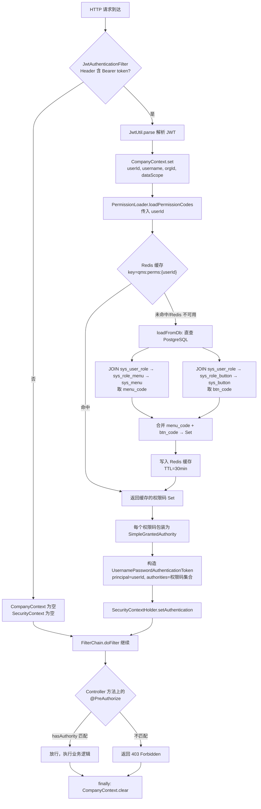
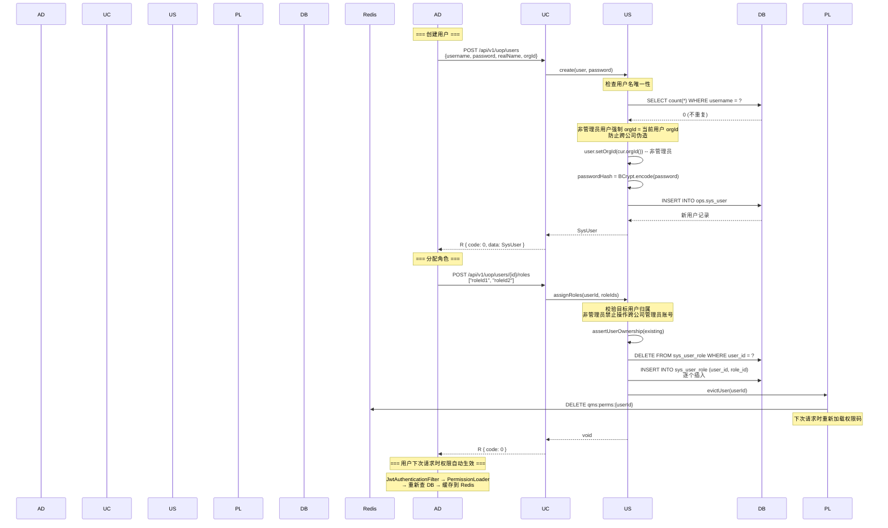
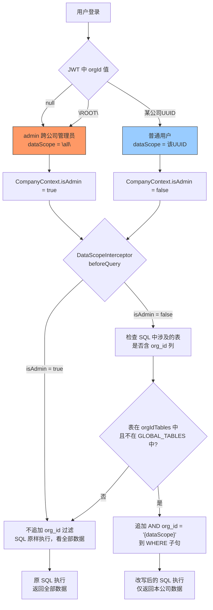

# UOP 域业务流程参考文档

> 康立 QMS 用户组织权限域 | 生成日期: 2026-07-24
> 数据源: AuthServiceImpl / UserServiceImpl / RoleServiceImpl / JwtAuthenticationFilter / PermissionLoader / DataScopeInterceptor / DataInitializer / SeedRunner

---

## 1. 登录时序图

用户从登录页输入用户名密码到进入首页的完整链路。

```mermaid
sequenceDiagram
    participant "前端 (Vue 3)" as F
    participant "AuthController<br/>POST /api/v1/auth/login" as A
    participant AuthServiceImpl as AS
    participant PostgreSQL as DB
    participant JwtUtil as J
    participant localStorage as LS
    F->>A: POST /api/v1/auth/login<br/>{username, password}
    A->>AS: login(username, password)
    AS->>DB: SELECT * FROM ops.sys_user<br/>WHERE username = ?
    DB-->>AS: SysUser (含 passwordHash, orgId, status)
    alt 用户不存在或密码错误
        AS-->>A: throw BusinessException(401, "用户名或密码错误")
        A-->>F: R { code: 401, msg: "用户名或密码错误" }
    else 账号已停用
        AS-->>A: throw BusinessException(401, "账号已停用或锁定")
        A-->>F: R { code: 401, msg: "账号已停用或锁定" }
    else 登录成功
        Note over AS: BCrypt.matches(password, passwordHash)
        Note over AS: orgId == null ? dataScope = "all" : dataScope = orgId
        AS->>J: generate(userId, username, orgId, dataScope)
        J-->>AS: JWT token (expiry 默认 1800s)
        AS-->>A: LoginResult(accessToken, expiresIn)
        A-->>F: R { code: 0, data: { accessToken, tokenType: "Bearer", expiresIn } }
    end
    F->>LS: localStorage['qms_token'] = accessToken
    Note over F: 后续请求自动带 Authorization: Bearer {token}
    F->>A: GET /api/v1/uop/me
    Note over A: JwtAuthenticationFilter 解析 JWT → CompanyContext.set()
    A-->>F: CurrentUserVo { userId, username, orgId, dataScope, permissions[] }
    F->>A: GET /api/v1/uop/menus/tree
    A-->>F: List<SysMenu> (树形，含 children)
    Note over F: 前端根据 permissions 过滤菜单<br/>生成动态路由 → 进入首页
```

**关键代码位置**:
- `AuthServiceImpl.login()`: 第 33-47 行 — BCrypt 校验 + dataScope 判定(`orgId == null ? "all" : orgId`)
- `JwtUtil.generate()`: JWT payload 含 `sub`(userId), `username`, `orgId`, `dataScope`
- `JwtAuthenticationFilter.doFilterInternal()`: 第 34-64 行 — 从 `Authorization: Bearer {token}` 解析 JWT，注入 `CompanyContext` + `SecurityContext`(authorities)

**dataScope 规则**:
| orgId | dataScope | 含义 |
|-------|-----------|------|
| null | `"all"` | 跨公司管理员，看全部数据 |
| "ROOT" | `"all"` | admin 的 JWT orgId 特殊值(非 UUID)，同样按管理员处理 |
| 某公司UUID | 该UUID | 普通用户，仅看本公司数据 |

---

## 2. 权限加载流程

每个 HTTP 请求如何获得权限码并完成 `@PreAuthorize` 鉴权。



**关键代码位置**:
- `PermissionLoader.loadPermissionCodes()`: 第 30-47 行 — Redis 缓存 key `qms:perms:{userId}`，TTL 30 分钟
- `PermissionLoader.loadFromDb()`: 第 68-81 行 — 两条 SQL: JOIN `sys_user_role → sys_role_menu → sys_menu` 取 `menu_code`，JOIN `sys_user_role → sys_role_button → sys_button` 取 `btn_code`
- `PermissionLoader.evictUser(userId)`: 删除单个用户缓存 key
- `PermissionLoader.evictAll()`: `redis.keys("qms:perms:*")` 批量删除全部缓存

**缓存失效时机**:
| 操作 | 调用方法 | 影响范围 |
|------|----------|----------|
| 用户分配角色 | `permissionLoader.evictUser(userId)` | 仅该用户 |
| 角色分配菜单/按钮 | `permissionLoader.evictAll()` | 全部用户 |
| 角色分配用户 | `permissionLoader.evictAll()` | 全部用户 |
| 删除角色 | `permissionLoader.evictAll()` | 全部用户 |
| 删除用户 | `permissionLoader.evictUser(id)` | 仅该用户 |

---

## 3. 用户管理流程

创建用户、分配角色、权限生效的完整链路。



**关键业务规则**:
- `assertUserOwnership()`: 普通用户禁止操作 `org_id = null` 的跨公司管理员账号(防借 resetPassword/assignRoles 提权)
- 非管理员创建用户时 `orgId` 强制设为当前用户 `orgId`，防止跨公司伪造
- `update()` 禁止修改 `orgId`，防止跨公司数据搬运
- 用户删除为软删除(`isDeleted = true`)，同时 `evictUser` 清权限缓存

---

## 4. 角色权限分配流程

角色创建后，管理员为角色分配菜单和按钮权限。

```mermaid
flowchart TD
    A["管理员创建角色"] --> B["POST /api/v1/uop/roles<br/>{roleCode, roleName, roleType, permDesc}"]
    B --> C["RoleServiceImpl.save<br/>INSERT INTO ops.sys_role"]
    C --> D["分配菜单权限"]
    D --> E["POST /api/v1/uop/roles/{id}/menus<br/>[\"menuId1\", \"menuId2\", ...]"]
    E --> F["RoleServiceImpl.assignMenus"]
    F --> G["DELETE sys_role_menu WHERE role_id = ?"]
    G --> H["逐个 INSERT sys_role_menu<br/>role_id + menu_id"]
    H --> I["permissionLoader.evictAll<br/>清全部用户权限缓存"]
    C --> J["分配按钮权限"]
    J --> K["POST /api/v1/uop/roles/{id}/buttons<br/>[\"buttonId1\", \"buttonId2\", ...]"]
    K --> L["RoleServiceImpl.assignButtons"]
    L --> M["DELETE sys_role_button WHERE role_id = ?"]
    M --> N["逐个 INSERT sys_role_button<br/>role_id + button_id"]
    N --> I
    C --> O["分配用户到角色"]
    O --> P["POST /api/v1/uop/roles/{id}/users<br/>[\"userId1\", \"userId2\", ...]"]
    P --> Q["RoleServiceImpl.assignUsers"]
    Q --> R["DELETE sys_user_role WHERE role_id = ?"]
    R --> S["逐个 INSERT sys_user_role<br/>user_id + role_id"]
    S --> I
    I --> T["Redis: DELETE qms:perms:*"]
    T --> U["所有用户下次请求时重新加载权限码"]
```

**权限码的来源**:
- 菜单 `menu_code` (如 `system.user.list`) → 菜单级权限(查看页面)
- 按钮 `btn_code` (如 `fia.sign.inspector`) → 按钮级权限(操作按钮)
- 两者合并为用户的 `authorities` 集合，供 `@PreAuthorize("hasAuthority('xxx')")` 校验

**权限分配与缓存策略**:
| 变更类型 | 缓存操作 | 理由 |
|----------|----------|------|
| 角色分配菜单 | `evictAll()` | 影响所有拥有该角色的用户 |
| 角色分配按钮 | `evictAll()` | 同上 |
| 角色分配用户 | `evictAll()` | 影响被分配/移除的用户 |
| 用户分配角色 | `evictUser(userId)` | 仅影响该用户 |

---

## 5. 多分公司数据隔离流程

简化多分公司模型: 公司 = 顶级 `org`(org_type = "公司")，用户 `org_id` 决定数据可见范围。



**DataScopeInterceptor 核心逻辑** (第 56-87 行):
```java
// 取当前用户
CompanyContext.CurrentUser u = CompanyContext.get();
if (u == null || CompanyContext.isAdmin()) { return; } // 管理员不过滤

// 确保已初始化含 org_id 列的表集合
ensureInited(); // 查 information_schema.columns 获取 ops schema 下所有含 org_id 列的表

// 解析 SQL，检查涉及的表是否在 orgIdTables 中
// 全局配置表(org_id 为 NULL 表示全公司共享)不追加过滤: spc_rule, sys_dict
// 追加条件: AND org_id = '{u.orgId()}'
```

**GLOBAL_TABLES**(不按公司过滤的全局表):
- `spc_rule` — SPC 判异规则(全公司共享)
- `sys_dict` — 系统字典(全公司共享)

**用户操作权限隔离**:
- `UserServiceImpl.assertUserOwnership()`: 非管理员禁止操作 `org_id = null` 的跨公司管理员账号
- `UserServiceImpl.create()`: 非管理员创建用户时 `orgId` 强制 = 当前用户 `orgId`
- `UserServiceImpl.update()`: 禁止通过 update 修改 `orgId`

---

## 6. 关键业务规则

### 6.1 admin 权限空问题

**问题**: `DataInitializer.seedRbac()` 有幂等检查 `if (count("ops.sys_role") > 0) { return; }`。如果角色表已有数据(如 Flyway 迁移预置)，seedRbac 直接跳过，导致 `assignUserRole("admin", sysadminRoleId)` 不执行。admin 用户无关联角色 → `PermissionLoader.loadFromDb()` 返回空 Set → `@PreAuthorize` 全部拒绝 → 403。

**修复**: `DataInitializer.seedExtraPerms()` **无幂等跳过**，每次启动都执行。第 153-157 行强制确保 admin 始终关联 sysadmin 角色:
```java
// 确保 admin 始终有关联 sysadmin 角色(seedRbac 有 count>0 幂等跳过,admin 关联可能被跳过)
String sysadminRoleId = queryId("SELECT id FROM ops.sys_role WHERE role_code='sysadmin'");
if (sysadminRoleId != null) {
    assignUserRole("admin", sysadminRoleId);
}
```
`assignUserRole()` 内部用 `linkMissing()` 检查是否已存在关联，已存在则跳过(幂等)。

### 6.2 admin 密码

两个 Runner 都会设置 admin 密码:
- `DataInitializer` (CommandLineRunner, 先执行): 密码 `admin123`
- `SeedRunner` (ApplicationRunner, 后执行): 密码 `123456`，**覆盖** DataInitializer 的设置

**最终密码**: `admin` / `123456`

### 6.3 前端 orgId 处理

- 前端不显式传 `orgId`，从 `GET /api/v1/uop/me` 返回的 `auth.user.orgId` 获取
- 管理员 `orgId` = `null` 或 `"ROOT"`，前端隐藏公司选择器或置灰
- 多分公司场景: 前端从组织树中筛选 `orgType = "公司"` 的节点作为公司列表

### 6.4 JWT 过期与无状态

- JWT 默认过期 1800 秒(30 分钟)，由 `qms.jwt.expiry` 配置
- 无 refresh token 机制，过期后前端跳转登录页
- JWT payload 中 `orgId` 为 `null` 时写 `"ROOT"` 字符串(避免 null 序列化问题)

### 6.5 种子数据初始化顺序

```
1. DataInitializer.run()         (CommandLineRunner, 先执行)
   ├── permissionLoader.evictAll()    清权限缓存
   ├── seedOrgsAndUsers()             MZ/SZ 公司 + admin + mzuser
   ├── seedRbac()                     角色/菜单/按钮/权限分配(幂等)
   ├── seedExtraPerms()               额外权限 + admin-sysadmin 兜底
   ├── seedFiaPerms()                 FIA 权限
   ├── seedSpcPerms()                 SPC 权限
   ├── seedNcmPerms()                 NCM 权限
   ├── seedSqmPerms()                 SQM 权限
   ├── seedPatlPerms()                巡检权限
   ├── seedSqmTrace()                 来料追溯演示数据
   └── seedFiaStd()                   FIA 标准库种子

2. SeedRunner.run()                  (ApplicationRunner, 后执行)
   ├── permissionLoader.evictAll()    清权限缓存
   └── 17 个角色账号(MZ/SZ × 8 角色 + admin), 密码统一 123456
```

---

## 附录 A: UOP 权限码清单

| 权限码 | 应用接口 | 说明 |
|--------|----------|------|
| `system.user.list` | GET /users, GET /users/{id}/roles | 查看用户列表 |
| `system.user.create` | POST /users, PUT /users/{id}, POST /users/{id}/reset-password | 创建/更新用户，重置密码 |
| `system.user.delete` | DELETE /users/{id} | 删除用户 |
| `system.role.list` | GET /roles, GET /roles/{id}/users | 查看角色列表 |
| `system.role.create` | POST /roles | 创建角色 |
| `system.role.delete` | DELETE /roles/{id} | 删除角色 |
| `system.role.assign` | POST /roles/{id}/menus, /roles/{id}/buttons, /roles/{id}/users, /users/{id}/roles | 分配菜单/按钮/用户/角色 |
| `system.org.list` | GET /orgs, GET /orgs/tree | 查看组织 |
| `system.org.create` | POST /orgs | 创建组织 |
| `system.org.delete` | DELETE /orgs/{id} | 删除组织 |
| `system.menu.list` | GET /menus, GET /menus/tree | 查看菜单 |
| `system.menu.create` | POST /menus | 创建菜单 |
| `system.menu.delete` | DELETE /menus/{id} | 删除菜单 |
| `system.delegation.manage` | GET/POST/DELETE /delegations | 代班管理 |

---

## 附录 B: 相关源码文件

| 文件 | 说明 |
|------|------|
| `qms-common/.../security/JwtAuthenticationFilter.java` | JWT 解析 → CompanyContext + SecurityContext |
| `qms-common/.../security/CompanyContext.java` | ThreadLocal 用户上下文 |
| `qms-common/.../security/PermissionLoader.java` | Redis 缓存权限码加载 |
| `qms-common/.../security/DataScopeInterceptor.java` | MyBatis 拦截器追加 org_id 过滤 |
| `qms-common/.../security/DataScopeGuard.java` | 数据归属校验工具 |
| `qms-service/.../uop/impl/AuthServiceImpl.java` | 登录认证 + dataScope 判定 |
| `qms-service/.../uop/impl/UserServiceImpl.java` | 用户 CRUD + 角色分配 + 归属校验 |
| `qms-service/.../uop/impl/RoleServiceImpl.java` | 角色 CRUD + 菜单/按钮/用户分配 |
| `qms-bootstrap/.../DataInitializer.java` | 种子数据(公司/角色/菜单/权限码) |
| `qms-bootstrap/.../SeedRunner.java` | 17 个角色账号种子 |